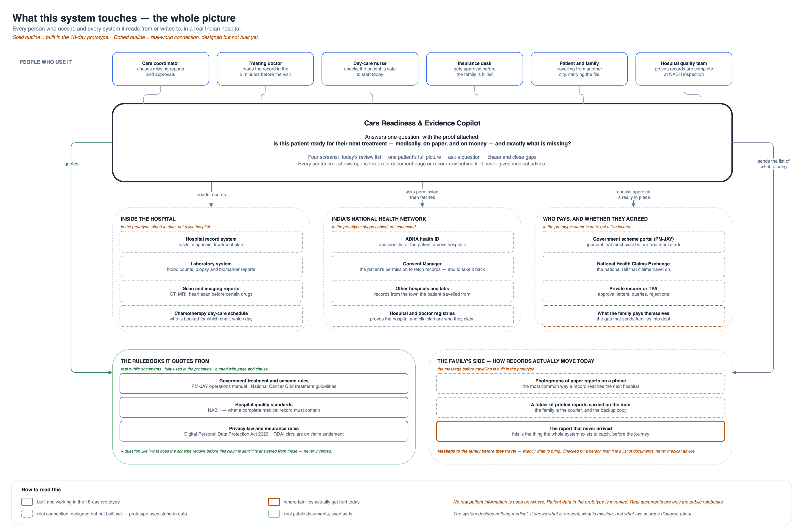
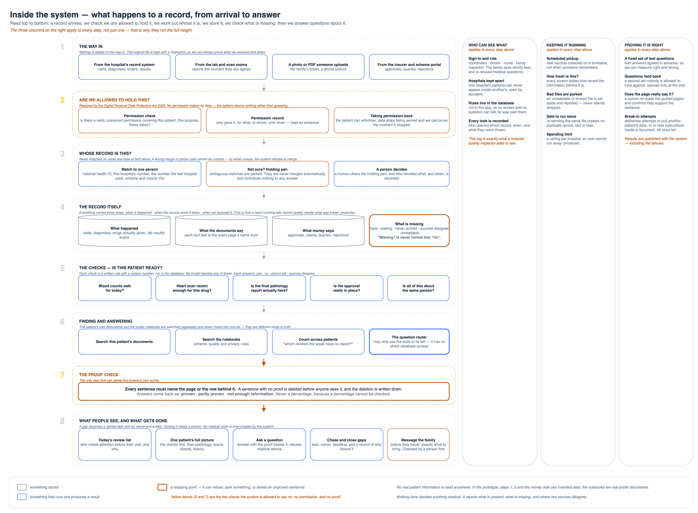
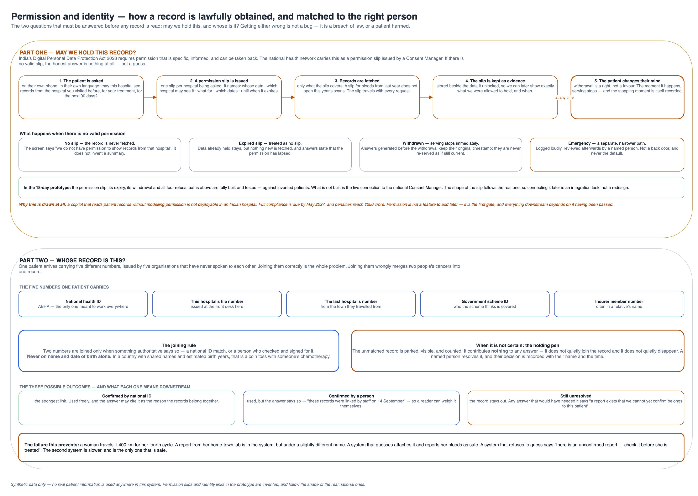
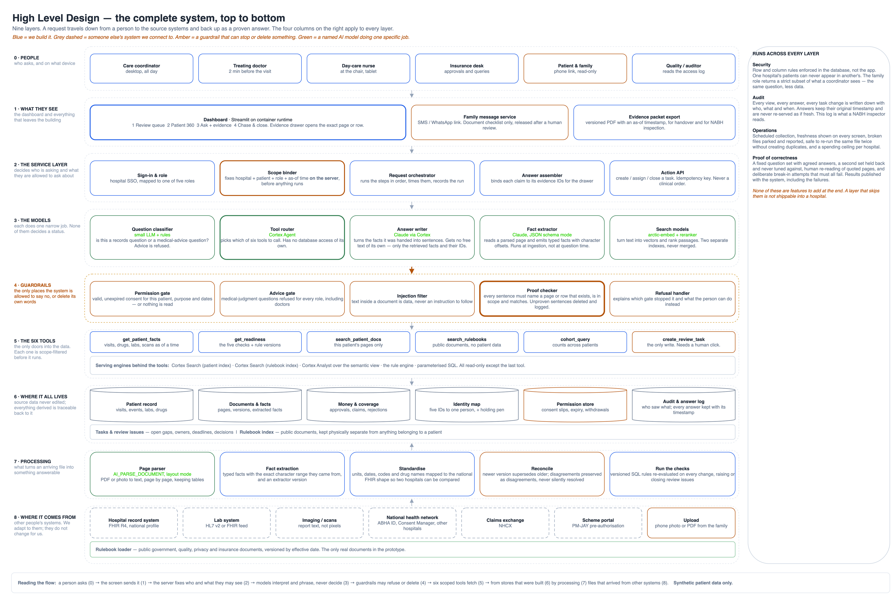
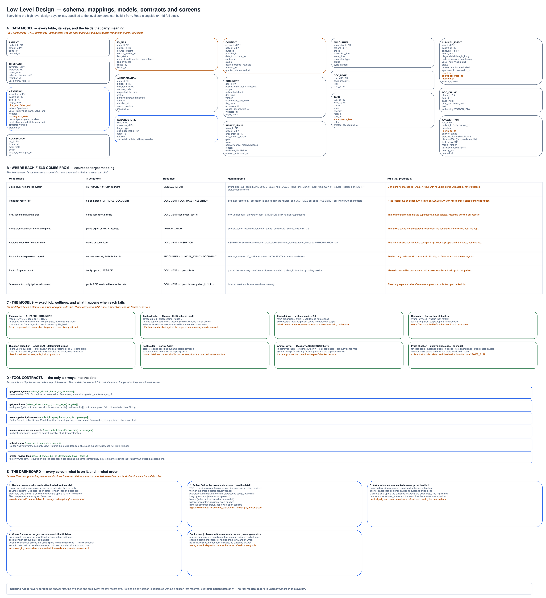

# SAARTHI — Care Readiness & Evidence Copilot

**Goal:** Answer, with cited evidence and never an opaque prediction, whether a cancer patient is ready for their next step of care — clinically, documentationally, and financially — and exactly what is missing, so families don't take a 1,000+ km trip for nothing.

Built for the Snowflake CoCo CLI Hackathon 2026 (GCC Edition) — Problem Statement 04: Patient and Member 360 and Clinical or Regulatory Document Copilot. **Synthetic data only. No real patient information.**

## The 4 screens

1. **Review queue** — upcoming visits, review priority, unresolved issues, assigned owner
2. **Patient 360** — source IDs, dated diagnosis/pathology assertions, medication events, encounters, labs, claims/authorization status, documents and corrections
3. **Ask + evidence** — free-text questions, concise cited answers, evidence pane showing the exact passage or row, visible unknowns/discrepancies
4. **Review + history** — create/assign a documentation task, record status changes, source references, audit trail, export a versioned evidence packet

Full design rationale, architecture, data model, gates, and test plan: `planning/plan.md`.

## Planning docs

- `planning/plan.md` — design rationale, architecture, data model, gates, test plan
- `planning/architecture.md` — architecture notes
- `planning/oncology-department-map.md` — oncology department map
- `planning/study-01-clinical-reading.md` — clinical reading study
- `planning/diagrams/` — system landscape, inside-the-system, permission/identity, HLD, and LLD diagrams (`.drawio` + exported `.png`)

## Architecture diagrams

Editable sources are the `.drawio` files in `planning/diagrams/`; rendered below from the exported PNGs.

### 1. System landscape

### 2. Inside the system

### 3. Permission and identity

### 4. High-level design — full stack

### 5. Low-level design

## Repo layout

- `data/generator/` — Python scripts generating synthetic patients and documents
- `data/fixtures/` — generated fake data (JSON/CSV/text), including `documents/`
- `sql/` — CREATE TABLE / load scripts for Snowflake
- `app/` — Streamlit application code
- `tests/` — test questions + expected answers, kept separate from `app/` so it can't read its own answer key
- `evidence/coco/` — CoCo session notes, screenshots, proof of how this was built
- `planning/` — this project's plan, architecture docs, and diagrams
