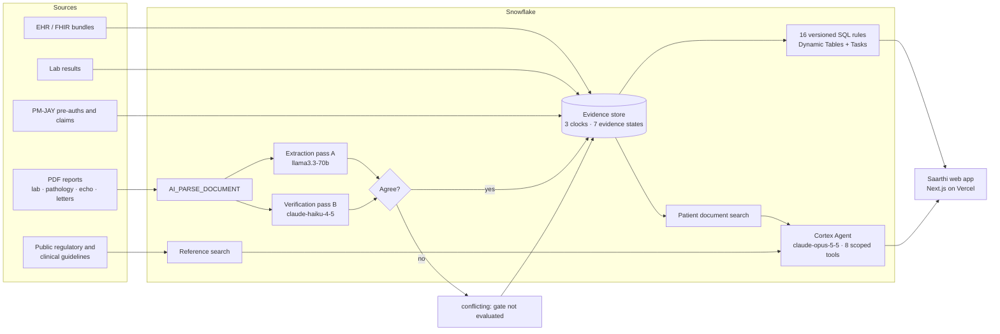

<h1><picture><source media="(prefers-color-scheme: dark)" srcset="docs/assets/saarthi-wordmark-dark.png" /></picture></h1>

**Know before they arrive.** The care-readiness and evidence copilot for hospital care teams. It tells you what is **missing**, **pending** or **conflicting** before every visit, and cites the page or row behind every claim.

[**Live app**](https://saarthi-360.vercel.app) · [Architecture](docs/architecture/SPEC.md) · [Judge walkthrough](docs/submission/JUDGE-WALKTHROUGH.md) · [Implementation status](IMPLEMENTATION-STATUS.md)

    


---

## The problem

A cancer day-care visit depends on a dozen records arriving on time: a recent echo, a fresh blood count, a pre-authorisation, the right pathology addendum. They come from different hospitals, labs and insurers, as structured rows and scanned PDFs. When one is missing, stale or contradicts another, the team usually finds out at the bedside, and the family may have travelled 1,000 km for nothing.

## What Saarthi does

Saarthi brings every source into one patient record and runs the readiness checks before the visit:

- **A readiness board for tomorrow.** Every visit is grouped as *needs review*, *waiting on evidence*, *advisory* or *checks met*, and each block names the rule and version that caused it.
- **One patient record.** Overview, facts, timeline, documents, coverage and family views, all drawn from the same governed reads.
- **A copilot that cites everything.** Ask "why is she blocked?" and get the failing checks, their rule versions, and links to the exact evidence. Voice or typed.
- **A source view for every claim.** One click opens the report page the fact came from, with all three clocks: when it happened, when it was recorded, and when Saarthi ingested it.
- **A hard line on clinical judgment.** "Should we hold her trastuzumab?" is refused for every role. Saarthi offers to prepare an evidence packet for the named treating practitioner instead.

<table>
<tr>
<td width="50%"><br /><sub><b>Patient record.</b> A failing LVEF check and a pre-authorisation conflict, each with its rule version and evidence IDs.</sub></td>
<td width="50%"><br /><sub><b>Cited answer.</b> "Why is she blocked?" answered from SQL, with both checks marked on screen.</sub></td>
</tr>
<tr>
<td width="50%"><br /><sub><b>Clinical judgment refused.</b> The decision belongs to the practitioner; Saarthi prepares the evidence.</sub></td>
<td width="50%"><br /><sub><b>Source document.</b> The echo report behind the LVEF check, with its three clocks.</sub></td>
</tr>
</table>

## How it works


```mermaid
flowchart LR
    subgraph Sources
        A[EHR / FHIR bundles]
        B[Lab results]
        C[PM-JAY pre-auths and claims]
        D[PDF reports<br/>lab · pathology · echo · letters]
        R[Public regulatory and<br/>clinical guidelines]
    end

    subgraph Snowflake
        P[AI_PARSE_DOCUMENT]
        X1[Extraction pass A<br/>llama3.3-70b]
        X2[Verification pass B<br/>claude-haiku-4-5]
        V{Agree?}
        E[(Evidence store<br/>3 clocks · 7 evidence states)]
        G[16 versioned SQL rules<br/>Dynamic Tables + Tasks]
        S1[Patient document search]
        S2[Reference search]
        AG[Cortex Agent<br/>claude-opus-5-5 · 8 scoped tools]
    end

    UI[Saarthi web app<br/>Next.js on Vercel]

    A & B & C --> E
    D --> P --> X1 & X2 --> V
    V -- yes --> E
    V -- no --> CF[conflicting: gate not evaluated] --> E
    E --> G --> UI
    E --> S1 --> AG
    R --> S2 --> AG
    AG --> UI
```

1. **Ingest.** Structured records land in Snowflake tables. PDFs land on an encrypted stage and are read by `AI_PARSE_DOCUMENT`.
2. **Extract twice.** Two model families read every safety-critical field independently, at temperature 0. If they disagree, the value is stored as `conflicting` and the gate returns `not_evaluated`. A value is never asserted from one unverified read.
3. **Decide in SQL.** 16 versioned rules (LVEF surveillance, neutrophil count, HER2 reflex testing, pre-authorisation and others) compute every status. No model decides a status, a number or a date.
4. **Answer with citations.** The Cortex Agent turns a question into bounded tool calls and phrases the result. Its tools have no `patient_id` input, so it cannot reach outside the user's scope.

## Engineering principles

These seven rules are enforced in code, and breaking one is treated as a defect. Full detail is in [`docs/architecture/SPEC.md`](docs/architecture/SPEC.md).

| | Rule |
|---|---|
| **R1** | **The model never decides.** It extracts typed assertions, plans bounded tool calls and phrases answers. Every status, number, date and threshold comes from SQL against a versioned rule. |
| **R2** | **Three clocks.** `event_time`, `source_recorded_at` and `ingested_at` are kept apart, and every answer carries `known_as_of`. |
| **R3** | **Missing is a state, not a NULL.** *present · explicitly negative · pending · not received · conflicting · unreadable · superseded.* "Not received" is never "negative". |
| **R4** | **Identity is ABHA-anchored.** Records are never joined on name. Ambiguous matches are quarantined and contribute no evidence. |
| **R5** | **Scope is enforced before retrieval.** A row access policy on `CURRENT_USER()`, owner's-rights tools with no patient input, and a search index that returns IDs only. |
| **R6** | **Two corpora, never mixed.** Patient documents and reference documents use physically separate Cortex Search services. |
| **R7** | **Never trust one read.** Two passes from two model families; disagreement fails closed. |

No confidence percentages appear anywhere. Saarthi reports the evidence state instead: *"final report not received"*, *"two sources disagree"*.

## Built on

| Layer | Technology |
|---|---|
| Data and rules | Snowflake tables, Dynamic Tables, Tasks, row access policies |
| Document AI | `AI_PARSE_DOCUMENT`, `AI_COMPLETE` (llama3.3-70b and claude-haiku-4-5) |
| Retrieval | Two Cortex Search services (patient, reference) |
| Copilot | Cortex Agent on `claude-opus-5-5` (pinned, never `auto`), 8 generic tools, 4 authored skills |
| App | Next.js 16 and TypeScript, deployed on Vercel |
| Build | Snowflake CoCo CLI. Lifecycle evidence is in [`evidence/coco/`](evidence/coco/) |

## Getting started

**Try it live:** [saarthi-360.vercel.app](https://saarthi-360.vercel.app) runs against a live Snowflake account with synthetic patients.

**Run it locally without Snowflake** (Python 3 and Node 20+):

```sh
python3 -m venv venv && ./venv/bin/pip install -r requirements.txt
./venv/bin/python -m pytest -q                    # backend and SQL-contract tests

cd frontend && npm ci
npm test && npm run typecheck                     # unit tests and types
SAARTHI_SNOWFLAKE_ENABLED=false npm run build     # production build
npx playwright install chromium && npm run test:e2e
SAARTHI_SNOWFLAKE_ENABLED=false npm run dev       # http://127.0.0.1:3000/design-preview/PAT-DC-07
```

With live access off, `/design-preview/PAT-DC-07` shows a recorded snapshot, labelled as such. Live routes fail closed rather than substitute fixture data.

**Deploy to your own Snowflake account:** run the ten files in [`backend/sql/deploy/`](backend/sql/deploy/README.md) in order in Snowsight, checking each VERIFY block. Then copy `frontend/.env.example` to `frontend/.env.local` and fill in the variables it lists. The app session is pinned to the `SAARTHI_APP` role with secondary roles disabled. See [`frontend/README.md`](frontend/README.md) and [`docs/platform/PROTOTYPE-COST-CONTROLS.md`](docs/platform/PROTOTYPE-COST-CONTROLS.md).

## Verification

| Check | Result | Run |
|---|---|---|
| Hosted demo check (`npm run demo:check`): day-care list, voice, every record section, 6 copilot questions, refusal, cited source, no page errors | **19 of 19 passed** | saarthi-360.vercel.app, 6 Oct 2026 |
| Python backend and SQL-contract tests | 565 passed, 14 skipped, 0 failed | offline, 6 Oct 2026 |
| Web unit tests | 381 passed, 0 failed | offline, 6 Oct 2026 |
| Playwright end-to-end (stubbed API) | 39 of 41 passed. `storyboard-visual` and `workspace-documents` fail on assertions the redesigned screens no longer match | offline, 6 Oct 2026 |
| Two-family extraction on 16 synthetic PDFs | 81 assertions verified, 9 left unverified, none forced to verified | live, 6 Oct 2026 |
| Deploy manifest gate (`check_gate.py --manifest`) | 71 active steps, all resolve | offline, 6 Oct 2026 |

Every failure we hit and how it was fixed is indexed in [`docs/testing/FAILURE-AND-FIX-INDEX.md`](docs/testing/FAILURE-AND-FIX-INDEX.md), with the raw review rounds in [`evidence/qa/`](evidence/qa/). Platform behaviour we verified empirically, with query IDs, is in [`docs/platform/PLATFORM-FINDINGS.md`](docs/platform/PLATFORM-FINDINGS.md).

## Repository

```
backend/
  sql/            tables, procedures, rules, tasks, dynamic tables, search, governance, agent; setup.sql manifest
  sql/deploy/     ten-file Snowsight deploy bundle
  extraction/     document extraction pipeline and comparison harness
  skills/         four agent skills
  scripts/        deploy, verification and evaluation tooling
  tests/          backend and SQL-contract tests
frontend/
  app/ components/ lib/   Next.js app and API routes
  contracts/      frozen answer schema shared with the backend
  fixtures/       recorded fixtures for offline runs
  tests/          unit, end-to-end and hosted demo checks
data/
  generator/      synthetic patient, FHIR and PDF generator
  generated/      synthetic cohort, documents and evaluation sets
  reference/      public reference PDFs (PM-JAY, FDA, ICMR, NCG, AIIMS)
docs/
  architecture/   specification, contracts, decision records, design reviews, diagrams
  research/       clinical, legal, platform and patient-reality research
  clinical/ design/ platform/ testing/ compliance/ submission/
evidence/         CoCo lifecycle evidence, QA rounds, live query receipts, demo screenshots
tools/            diagram generator, release gate
```

## Status and limitations

Saarthi is a working prototype, not a clinical product. [`IMPLEMENTATION-STATUS.md`](IMPLEMENTATION-STATUS.md) marks every component *built*, *partial* or *designed-only*, with the account and date it was exercised.

- **Synthetic data only.** 13 synthetic day-care patients. No real patient data is loaded anywhere in the system.
- **Not clinically validated.** The tests are engineering checks on synthetic data. Three rule thresholds are practice consensus and are labelled as such.
- **One department mapped.** Rules, ontology and documents are data, so the design is department-agnostic, but only day-care chemotherapy is mapped today.
- **Single app role.** The hosted app runs as one restricted service role. There is no per-user login yet.
- **No scored evaluation.** 96 independent evaluation questions exist (48 development, 48 held out). The end-to-end answer evaluation and a baseline comparison have not been run.
- **Skills authored, not loaded.** The four `SKILL.md` definitions and their upload script exist; loading them into the agent has not been verified on Snowflake.

## Responsible AI

India's NMC Telemedicine Practice Guidelines (2020) prohibit AI platforms from clinical counselling or prescribing, and the registered practitioner stays accountable. Saarthi enforces that boundary in three places: the SQL classifier ([`classify_question.sql`](backend/sql/procedures/classify_question.sql)), the agent instructions, and the web routing ([`question-routing.mjs`](frontend/lib/question-routing.mjs)). Ambiguous questions default to refusal.

The design was informed by 19 real medical reports shared, with consent, by a team member's family. They were used for format research only and are not in this repository or the system. See [`docs/compliance/DATASET-LICENCES.md`](docs/compliance/DATASET-LICENCES.md).

---

<div align="center">
<sub>Built for the Snowflake CoCo CLI Hackathon 2026 (GCC Edition), Problem Statement 04: Patient and Member 360 and Clinical or Regulatory Document Copilot.</sub>
</div>
