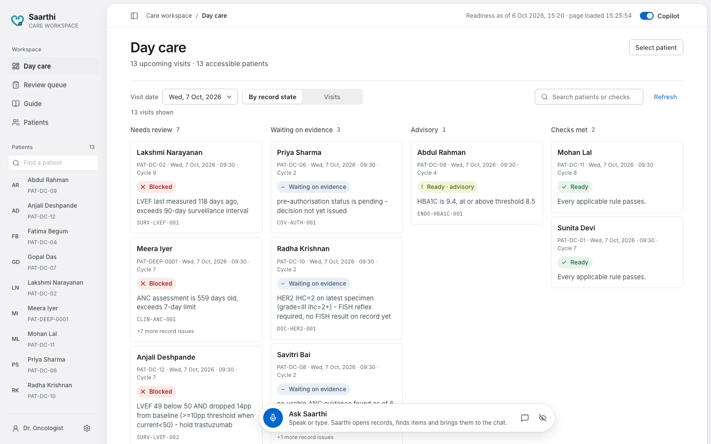
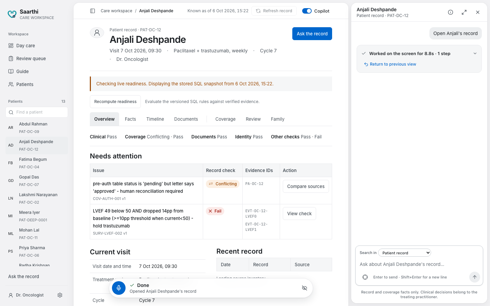
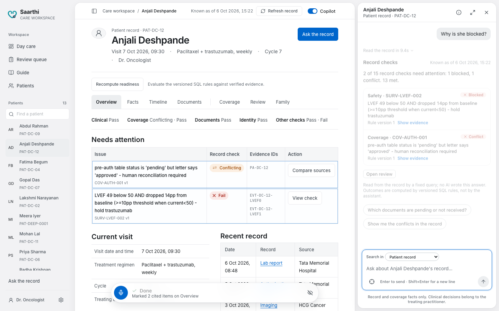
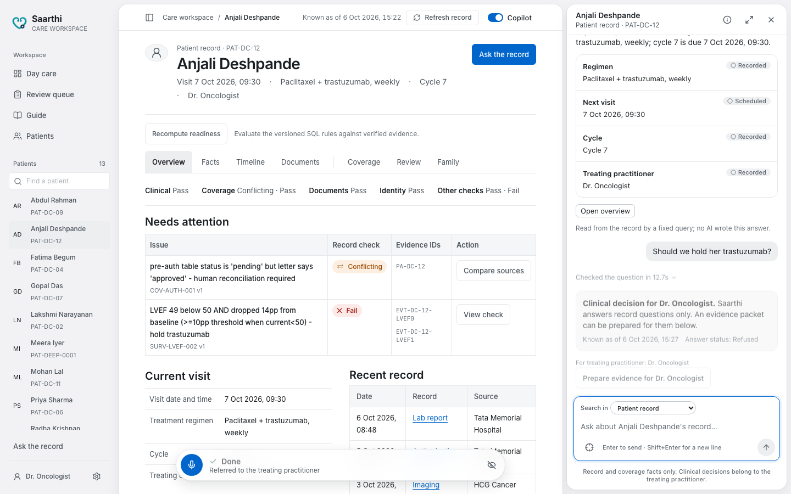
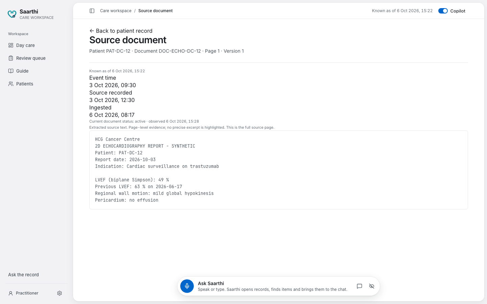
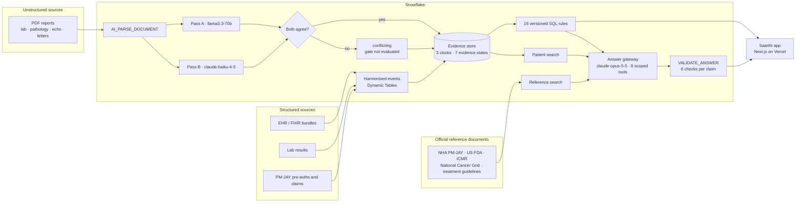
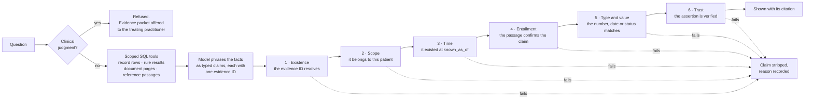

<h1><picture><source media="(prefers-color-scheme: dark)" srcset="docs/assets/saarthi-wordmark-dark.png" /></picture></h1>

**Know before they arrive.** The care-readiness and evidence copilot for hospital care teams. It identifies what is **missing**, **pending** or **conflicting** before every visit, and cites the source page or record behind every claim.

[**Live app**](https://saarthi-360.vercel.app) · [Architecture](docs/architecture/SPEC.md) · [Evaluation guide](docs/submission/JUDGE-WALKTHROUGH.md) · [Implementation status](IMPLEMENTATION-STATUS.md)

    



---

## The challenge

Saarthi is a submission to the **Snowflake CoCo CLI Hackathon 2026 (GCC Edition)**, for **Problem Statement 04: Patient and Member 360 and Clinical or Regulatory Document Copilot**. The brief, as published by the organisers:

> Care and life sciences teams work across siloed EHR and claims data and dense unstructured documents.
>
> Build a copilot that unifies data into a patient or member 360 and answers clinical, safety, or regulatory questions with cited evidence. Use fully synthetic or de identified data only.
>
> - Combine structured records with unstructured clinical, regulatory, or legal documents
> - Produce risk stratification, evidence retrieval, or a cited answer, never opaque predictions
> - Deliver a question and answer experience with clear source evidence

How Saarthi answers each requirement:

| The brief asks for | What Saarthi does |
|---|---|
| A patient 360 from siloed EHR and claims data | One record per patient built from synthetic EHR/FHIR bundles, lab results, PM-JAY pre-authorisations and claims, with identity links checked by rule (ABHA-linked, manually verified or quarantined), never joined on name |
| Structured records combined with unstructured documents | Lab, pathology and echo reports and authorisation letters are parsed with `AI_PARSE_DOCUMENT`, cross-checked by two model families and linked to the structured events they describe. Public regulatory and clinical documents (PM-JAY, FDA, ICMR, NCG, AIIMS) sit in a separate reference corpus |
| Risk stratification, never opaque predictions | 16 versioned SQL rules stratify every visit as *blocked*, *waiting on evidence*, *advisory* or *ready*. Each outcome opens to its rule, version and evidence. There is no trained model and no confidence score |
| Answers to clinical, safety or regulatory questions with cited evidence | The copilot answers record, safety-surveillance and coverage questions from SQL, and regulatory questions from verbatim reference passages with publisher, title and page. Questions that ask for a clinical decision are refused and routed to the treating practitioner, as Indian telemedicine rules require |
| A Q&A experience with clear source evidence | Every claim in an answer links to the page or row it came from, with the time it happened, was recorded and was ingested |
| Synthetic or de-identified data only | Synthetic only. No real patient data is loaded anywhere in the system |

Judging focus: **Real-World Relevance** (30%), **Technical Execution** (40%) and **Solution Completeness** (30%). The full brief and CoCo usage guidelines are in [`docs/PROBLEM-STATEMENT.md`](docs/PROBLEM-STATEMENT.md).

## The problem on the ward

A cancer day-care visit depends on a dozen records arriving on time: a recent echo, a fresh blood count, a pre-authorisation, the right pathology addendum. They come from different hospitals, labs and insurers, as structured rows and scanned PDFs. When one is missing, stale or contradicts another, the team usually finds out at the bedside, and a family may have travelled more than 1,000 km for a visit that cannot proceed.

## What Saarthi does

Saarthi brings every source into one patient record and runs the readiness checks before the visit:

- **A readiness board for tomorrow.** Every visit is grouped as *needs review*, *waiting on evidence*, *advisory* or *checks met*, and each block names the rule and version that caused it.
- **One patient record.** Overview, facts, timeline, documents, coverage and family views, all drawn from the same governed reads.
- **A copilot that cites everything.** Ask "why is she blocked?" and get the failing checks, their rule versions, and links to the exact evidence. Voice or typed.
- **A source view for every claim.** One click opens the report page the fact came from, with all three clocks: when it happened, when it was recorded, and when Saarthi ingested it.
- **A defined clinical boundary.** Questions that ask for a clinical decision, such as "Should we hold her trastuzumab?", are declined for every role. Saarthi offers an evidence packet for the named treating practitioner instead.

<table>
<tr>
<td width="50%"><br /><sub><b>Patient record.</b> A failing LVEF check and a pre-authorisation conflict, each with its rule version and evidence IDs.</sub></td>
<td width="50%"><br /><sub><b>Cited answer.</b> "Why is she blocked?" answered from SQL, with both checks marked on screen.</sub></td>
</tr>
<tr>
<td width="50%"><br /><sub><b>Clinical judgment refused.</b> The decision belongs to the practitioner; Saarthi prepares the evidence.</sub></td>
<td width="50%"><br /><sub><b>Source document.</b> The echo report behind the LVEF check, with its three clocks.</sub></td>
</tr>
</table>

## The data: structured and unstructured, in one record

Saarthi's value comes from joining two kinds of data that hospitals keep apart. Every fact keeps its source, its three clocks and its evidence state, whichever path it arrived by.

| | Structured | Unstructured | Reference |
|---|---|---|---|
| **What** | EHR/FHIR R4 bundles, lab results, encounters, regimens, PM-JAY pre-authorisations and claims | Lab, pathology and echo reports and pre-authorisation letters, as PDFs | Official regulatory and clinical documents |
| **In this repo** | 12 FHIR bundles and per-facility CSV extracts from 4 synthetic facilities ([`data/generated/`](data/generated/)) | 22 synthetic cohort PDFs, plus 16 evaluation PDFs | 7 public PDFs: National Health Authority (PM-JAY), US FDA (trastuzumab label), ICMR (3), National Cancer Grid, state treatment guidelines ([`data/reference/`](data/reference/)) |
| **How it is read** | Loaded into typed Snowflake tables and harmonised into one event stream by Dynamic Tables | `AI_PARSE_DOCUMENT`, then two independent extraction passes from different model families | Parsed and chunked into its own Cortex Search service |
| **What it becomes** | Events with `event_time`, `source_recorded_at`, `ingested_at` | Typed assertions linked to the page they came from, *verified* only when both passes agree | Quotable passages with publisher, title, version and page |

The synthetic generator ([`data/generator/`](data/generator/)) plants the problems real records have, from 13 named corruption scenarios: a pathology addendum that arrives weeks late, HER2 results that disagree between labs, `1.9 lakhs` next to `190000`, a pre-authorisation that is *pending* in the table and *approved* in the letter, a quarantined identity, a prompt injection inside a document, and a misread value on a rotated scan. 10 of the 13 are seeded and tested; the other 3 are handled by design but not yet tested.

## How it works


```mermaid
flowchart LR
    subgraph S["Structured sources"]
        A["EHR / FHIR bundles"]
        B["Lab results"]
        C["PM-JAY pre-auths and claims"]
    end
    subgraph U["Unstructured sources"]
        D["PDF reports<br/>lab · pathology · echo · letters"]
    end
    subgraph RS["Official reference documents"]
        R["NHA PM-JAY · US FDA · ICMR<br/>National Cancer Grid · treatment guidelines"]
    end

    subgraph SF["Snowflake"]
        H["Harmonised events<br/>Dynamic Tables"]
        P["AI_PARSE_DOCUMENT"]
        X1["Pass A · llama3.3-70b"]
        X2["Pass B · claude-haiku-4-5"]
        V{"Both agree?"}
        CF["conflicting<br/>gate not evaluated"]
        E[("Evidence store<br/>3 clocks · 7 evidence states")]
        G["16 versioned SQL rules"]
        S1["Patient search"]
        S2["Reference search"]
        AG["Answer gateway<br/>claude-opus-5-5 · 8 scoped tools"]
        VA["VALIDATE_ANSWER<br/>6 checks per claim"]
    end

    UI["Saarthi app<br/>Next.js on Vercel"]

    A & B & C --> H --> E
    D --> P --> X1 & X2 --> V
    V -- yes --> E
    V -- no --> CF --> E
    E --> G --> UI
    E --> S1 --> AG
    R --> S2 --> AG
    G --> AG
    AG --> VA --> UI
```

1. **Ingest both kinds of data.** Structured records land in typed tables and are harmonised into one event stream. PDFs land on an encrypted stage and are read by `AI_PARSE_DOCUMENT`.
2. **Extract twice.** Two model families read every safety-critical field independently, at temperature 0. If they disagree, the value is stored as `conflicting` and the gate returns `not_evaluated`. A value is never asserted from one unverified read.
3. **Decide in SQL.** 16 versioned rules (LVEF surveillance, neutrophil count, HER2 reflex testing, pre-authorisation and others) compute every status. No model decides a status, a number or a date.
4. **Answer, then verify.** The model only phrases facts the SQL tools returned. Every claim it makes is checked against its cited source before it is shown (next section).

## How every answer is checked against its evidence

No model output is shown without verification. A model's answer is a set of **typed claims** (numeric, date, status or text), each pointing at exactly one piece of evidence. Before anything reaches the screen, [`VALIDATE_ANSWER`](backend/sql/procedures/validate_answer.sql) runs six checks on every claim, in SQL:


```mermaid
flowchart LR
    Q["Question"] --> CL{"Clinical<br/>judgment?"}
    CL -- yes --> RF["Refused.<br/>Evidence packet offered<br/>to the treating practitioner"]
    CL -- no --> T["Scoped SQL tools<br/>record rows · rule results<br/>document pages · reference passages"]
    T --> M["Model phrases the facts<br/>as typed claims, each with<br/>one evidence ID"]
    M --> C1["1 · Existence<br/>the evidence ID resolves"]
    C1 --> C2["2 · Scope<br/>it belongs to this patient"]
    C2 --> C3["3 · Time<br/>it existed at known_as_of"]
    C3 --> C4["4 · Entailment<br/>the passage confirms the claim"]
    C4 --> C5["5 · Type and value<br/>the number, date or status matches"]
    C5 --> C6["6 · Trust<br/>the assertion is verified"]
    C6 --> OK["Shown with its citation"]
    C1 & C2 & C3 & C4 & C5 & C6 -. fails .-> X["Claim stripped,<br/>reason recorded"]
```

- **It fails closed.** A claim that fails any check is removed and the reason is logged; a fabricated or cross-patient evidence ID is also recorded as a security event. If the entailment check (`AI_FILTER`) errors, the claim is stripped, never passed. The answer reports how many claims were accepted and its overall status.
- **Record answers are quoted, not written.** Facts come from canonical row and page quotations, and rule results come with their rule ID and version.
- **Regulatory answers are quoted verbatim.** For reference questions, Cortex Search ranks pages in the reference corpus and a fixed term-overlap rule picks the matching sentences ([`reference-answer.mjs`](frontend/lib/reference-answer.mjs)). They are shown word for word with publisher, title, version and page. No model writes or paraphrases them, and they are never presented as findings about the patient.
- **Every reference document is fingerprinted.** [`catalog.json`](data/reference/catalog.json) records each file's SHA-256, publisher, title and version, and whether its origin was byte-matched against the publisher's download. Where a field could not be verified, it says so.

### The rules themselves are traced to official sources

The thresholds the rules use are checked against the documents that govern treatment. [`verify_clinical_proof.py`](backend/scripts/verify_clinical_proof.py) downloads each official source, confirms its fingerprint, finds every quoted requirement word for word on the stated page, and compares the rule's numbers with the document's.

| Result | Count |
|---|---|
| Requirements traced to a named, dated official document | 55, from 13 sources (regimen protocols, the trastuzumab label, a nursing checklist, the PM-JAY manual) |
| Quotes found verbatim on the stated page | 58 of 58 |
| Requirements fully met by Saarthi's rules today | 11 of 53 in scope (21%); 20 of 53 met or partly met (38%) |

The gaps are reported, not hidden: the [coverage report](evidence/clinical/REPORT.md) lists every requirement Saarthi does not yet check, and any rule looser than its source must be labelled *unsafe*. This is engineering traceability, not clinical validation.

## Engineering principles

These seven rules are enforced in code, and breaking one is treated as a defect. Full detail is in [`docs/architecture/SPEC.md`](docs/architecture/SPEC.md).

| | Rule |
|---|---|
| **R1** | **The model never decides.** It extracts typed assertions, plans bounded tool calls and phrases answers. Every status, number, date and threshold comes from SQL against a versioned rule. |
| **R2** | **Three clocks.** `event_time`, `source_recorded_at` and `ingested_at` are kept apart, and every answer carries `known_as_of`. |
| **R3** | **Missing is a state, not a NULL.** *present · explicitly negative · pending · not received · conflicting · unreadable · superseded.* "Not received" is never "negative". |
| **R4** | **Identity is ABHA-anchored.** Records are never joined on name. Ambiguous matches are quarantined and contribute no evidence. |
| **R5** | **Scope is enforced before retrieval.** A row access policy on `CURRENT_USER()`, owner's-rights tools with no patient input, and a search index that returns IDs only. |
| **R6** | **Two corpora, never mixed.** Patient documents and reference documents use physically separate Cortex Search services. |
| **R7** | **Never trust one read.** Two passes from two model families; disagreement fails closed. |

No confidence percentages appear anywhere. Saarthi reports the evidence state instead: *"final report not received"*, *"two sources disagree"*.

## Built on

| Layer | Technology |
|---|---|
| Data and rules | Snowflake tables, Dynamic Tables, Tasks, row access policies |
| Document AI | `AI_PARSE_DOCUMENT`, `AI_COMPLETE` (llama3.3-70b and claude-haiku-4-5) |
| Retrieval | Two Cortex Search services (patient, reference) |
| Copilot | Cortex Agent on `claude-opus-5-5` (pinned, never `auto`), 8 generic tools, 4 authored skills |
| App | Next.js 16 and TypeScript, deployed on Vercel |
| Build | Snowflake CoCo CLI. Lifecycle evidence is in [`evidence/coco/`](evidence/coco/) |

## Getting started

**Try it live:** [saarthi-360.vercel.app](https://saarthi-360.vercel.app) runs against a live Snowflake account with synthetic patients.

**Run it locally without Snowflake** (Python 3 and Node 20+):

```sh
python3 -m venv venv && ./venv/bin/pip install -r requirements.txt
./venv/bin/python -m pytest -q                    # backend and SQL-contract tests

cd frontend && npm ci
npm test && npm run typecheck                     # unit tests and types
SAARTHI_SNOWFLAKE_ENABLED=false npm run build     # production build
npx playwright install chromium && npm run test:e2e
SAARTHI_SNOWFLAKE_ENABLED=false npm run dev       # http://127.0.0.1:3000/design-preview/PAT-DC-07
```

With live access off, `/design-preview/PAT-DC-07` shows a recorded snapshot, labelled as such. Live routes fail closed rather than substitute fixture data.

**Deploy to your own Snowflake account:** run the ten files in [`backend/sql/deploy/`](backend/sql/deploy/README.md) in order in Snowsight, checking each VERIFY block. Then copy `frontend/.env.example` to `frontend/.env.local` and fill in the variables it lists. The app session is pinned to the `SAARTHI_APP` role with secondary roles disabled. See [`frontend/README.md`](frontend/README.md) and [`docs/platform/PROTOTYPE-COST-CONTROLS.md`](docs/platform/PROTOTYPE-COST-CONTROLS.md).

## Verification

| Check | Result | Run |
|---|---|---|
| Hosted demo check (`npm run demo:check`): day-care list, voice, every record section, 6 copilot questions, refusal, cited source, no page errors | **19 of 19 passed** | saarthi-360.vercel.app, 6 Oct 2026 |
| Python backend and SQL-contract tests | 565 passed, 14 skipped, 0 failed | offline, 6 Oct 2026 |
| Web unit tests | 381 passed, 0 failed | offline, 6 Oct 2026 |
| Playwright end-to-end (stubbed API) | 39 of 41 passed. `storyboard-visual` and `workspace-documents` fail on assertions the redesigned screens no longer match | offline, 6 Oct 2026 |
| Two-family extraction on 16 synthetic PDFs | 81 assertions verified, 9 left unverified, none forced to verified | live, 6 Oct 2026 |
| Deploy manifest gate (`check_gate.py --manifest`) | 71 active steps, all resolve | offline, 6 Oct 2026 |

Every recorded failure, with its root cause and fix, is indexed in [`docs/testing/FAILURE-AND-FIX-INDEX.md`](docs/testing/FAILURE-AND-FIX-INDEX.md), with the raw review rounds in [`evidence/qa/`](evidence/qa/). Platform behaviour we verified empirically, with query IDs, is in [`docs/platform/PLATFORM-FINDINGS.md`](docs/platform/PLATFORM-FINDINGS.md).

## Repository

```
backend/
  sql/            tables, procedures, rules, tasks, dynamic tables, search, governance, agent; setup.sql manifest
  sql/deploy/     ten-file Snowsight deploy bundle
  extraction/     document extraction pipeline and comparison harness
  skills/         four agent skills
  scripts/        deploy, verification and evaluation tooling
  tests/          backend and SQL-contract tests
frontend/
  app/ components/ lib/   Next.js app and API routes
  contracts/      frozen answer schema shared with the backend
  fixtures/       recorded fixtures for offline runs
  tests/          unit, end-to-end and hosted demo checks
data/
  generator/      synthetic patient, FHIR and PDF generator
  generated/      synthetic cohort, documents and evaluation sets
  reference/      public reference PDFs (PM-JAY, FDA, ICMR, NCG, AIIMS)
docs/
  architecture/   specification, contracts, decision records, design reviews, diagrams
  research/       clinical, legal, platform and patient-reality research
  clinical/ design/ platform/ testing/ compliance/ submission/
evidence/         CoCo lifecycle evidence, QA rounds, live query receipts, demo screenshots
tools/            diagram generator, release gate
```

## Status and limitations

Saarthi is a working prototype, not a clinical product. [`IMPLEMENTATION-STATUS.md`](IMPLEMENTATION-STATUS.md) marks every component *built*, *partial* or *designed-only*, with the account and date it was exercised.

- **Synthetic data only.** 13 synthetic day-care patients. No real patient data is loaded anywhere in the system.
- **Not clinically validated.** The tests are engineering checks on synthetic data. Three rule thresholds are practice consensus and are labelled as such.
- **One department mapped.** Rules, ontology and documents are data, so the design is department-agnostic, but only day-care chemotherapy is mapped today.
- **Single app role.** The hosted app runs as one restricted service role. There is no per-user login yet.
- **No scored evaluation.** 96 independent evaluation questions exist (48 development, 48 held out). The end-to-end answer evaluation and a baseline comparison have not been run.
- **One reference document is unreadable.** The PM-JAY Health Benefit Package 2.2 manual loaded with no extractable text, so 6 of the 7 reference documents are searchable.
- **Skills authored, not loaded.** The four `SKILL.md` definitions and their upload script exist; loading them into the agent has not been verified on Snowflake.

## Responsible AI

India's NMC Telemedicine Practice Guidelines (2020) prohibit AI platforms from clinical counselling or prescribing, and the registered practitioner stays accountable. Saarthi enforces that boundary in three places: the SQL classifier ([`classify_question.sql`](backend/sql/procedures/classify_question.sql)), the agent instructions, and the web routing ([`question-routing.mjs`](frontend/lib/question-routing.mjs)). Ambiguous questions default to refusal.

The design was informed by 19 real medical reports shared, with consent, by a team member's family. They were used for format research only and are not in this repository or the system. See [`docs/compliance/DATASET-LICENCES.md`](docs/compliance/DATASET-LICENCES.md).

---

<div align="center">
<sub>Built for the Snowflake CoCo CLI Hackathon 2026 (GCC Edition), Problem Statement 04: Patient and Member 360 and Clinical or Regulatory Document Copilot.</sub>
</div>
