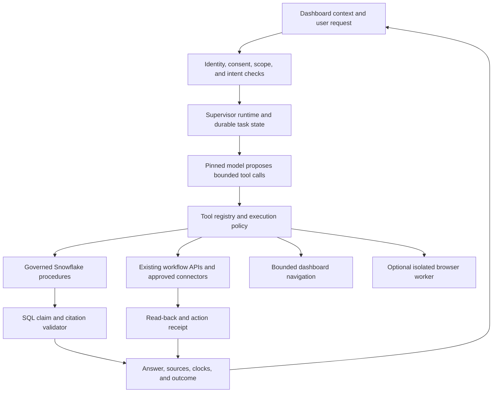

# Saarthi Dashboard Supervisor — Capabilities, Models, and Delivery Requirements

**Research date: 6 October 2026. Decision document, not a claim of deployed completeness.**

## 1. The product to build

Saarthi should be an evidence and workflow supervisor across the entire authorized care workspace. A user should be able to ask what needs attention, inspect why, navigate to the exact evidence, prepare the appropriate operational action, execute an authorized action, and see proof that it completed. It should retain the task through navigation and long-running processing while respecting patient selection, consent, and the current evidence snapshot.

The distinctive experience is **question → evidence → operational action → verified outcome**, with a visible source and audit trail at each step. “Godlike” is an ambition for breadth and usability; it is not a technical guarantee. No provider establishes that its model can reliably do every dashboard task. Industry impact must be demonstrated through completed workflows and measured benefit.

Recommendation: retain the working Opus 5.5 deployment as the baseline; build the missing supervisor runtime and governed tools; compare GPT‑6.1 Sol against exactly the same tasks before selecting a new primary model. Evaluate frontier escalation only for tasks the baseline fails. A model change alone cannot create missing data, APIs, permissions, persistence, or workflow receipts.

## 2. Clinician experience contract

**The copilot is an optional layer of service over a complete dashboard.** Clinicians retain direct access to every authorized record, source, check, filter, and permitted workflow through the dashboard. They can inspect and act manually, delegate software steps to Saarthi, or move between both approaches during the same task. Closing the copilot leaves the workspace fully usable.

The two interaction paths must share the same data, authorization, SQL rules, workflow APIs, and receipts. A change made through the copilot appears in the dashboard after verified read-back; a manual change invalidates or refreshes the copilot's affected context. The copilot should show where it is working and provide direct links to the corresponding dashboard view. Its convenience must not create a hidden record state or a separate source of truth.

The design should feel like a layer of luxury: readily available, context-aware, and effortless to use when desired. Preserve manual controls and clear navigation. Avoid forced chat entry points, automatic panel opening that interrupts work, or requiring a conversation to reach an existing dashboard function. Model or connector failure must leave manual workflows available wherever their underlying dependencies remain healthy.

**The software work should disappear behind a clear request.** The clinician describes the outcome; Saarthi handles finding, filtering, opening, comparing, preparing, and tracking through the registered capabilities. It preserves the professional's attention for reviewing evidence and making clinical decisions.

The interface should feel like one capable colleague who stays with the work. The user should not need to choose an AI model, select tools, understand connectors, manage a prompt, or learn a special command syntax. Provider and infrastructure choices belong in administration. Internal terms such as RAG, MCP, token budgets, and SQL should not appear in ordinary care workflows.

| Experience requirement | Required product behavior | Example |
|---|---|---|
| Start from the work | Show a concise authorized worklist, freshness, and unresolved operational items | “Review my upcoming visits” |
| One request carries a workflow | Resolve a request into permitted steps and finish it without making the user traverse every page | “Prepare the evidence packet and create a review task for this missing report” |
| Stay aware of the page | Use the current section and selected evidence; ask only when scope or outcome is materially ambiguous | “Explain this discrepancy” after attaching the displayed check |
| Carry the task across views | Preserve task progress and navigation return; isolate the selected patient's conversation | Opening a source does not lose the investigation |
| Show the outcome first | Present a concise answer or completion receipt; expose evidence and audit detail on demand | “Review task created” with its owner, state, and source link |
| Use ordinary language | Recognize clinician vocabulary and evaluated synonyms without requiring exact field names | “Platelet report” resolves through the existing ontology |
| Make the next useful step obvious | Offer a small number of context-relevant operational actions supported by the record | “Open report”, “Prepare packet”, “Create review task” |
| Minimize repeated interaction | Apply established role and action policies; reuse authorization within its actual scope | An authorized routine action does not require several redundant dialogs |
| Keep consequential changes legible | Explain the target and effect before execution where review is required; show a verified receipt afterward | A connector task identifies destination and submitted payload |
| Make interruption safe | Show actual progress; accept Stop or corrections; disclose any action already completed | “Stopped further steps; the review task was already created” |
| Explain incomplete work usefully | Name the missing evidence or failed dependency and preserve completed work | “Final report not received; the available sources are ready to review” |
| Make the interface calm | Clear hierarchy, readable text, accessible controls, contained citations, stable layouts | Long answers never hide the composer or Send control |
| Preserve manual control | Every existing dashboard function remains directly accessible; handoff between manual and delegated work keeps state synchronized | Open a source manually, ask about it, then finish the review through the dashboard |

The default conversation should display a short result and the most useful next action. Detailed evidence opens progressively, preserving the exact claim and cutoff. Successful routine work should not produce a wall of tool logs. A task requiring a human decision should arrive with its evidence already prepared, the decision clearly identified, and the appropriate practitioner named.

**Broad competence is a coverage goal:** every supported software workflow should be reachable through ordinary language and finish with an observable outcome. If a workflow is unsupported, the system must say what is missing and preserve the context. “There is nothing it cannot do” cannot be a release claim; the capability registry and test suite define actual coverage. Unsupported treatment decisions, inaccessible records, and unavailable connectors cannot be solved by a more assertive prompt.

Measure elegance through work, not appearance alone: clinician steps per completed workflow; avoidable interruptions; time spent searching; task completion without assistance; successful return from a source; correction frequency; and repeat use for real operational work. Compare these with the dashboard's manual path using synthetic tasks first. Attractive UI supports adoption; reduced work and dependable results give professionals a reason to return.

## 3. What the problem statement actually requires

The authoritative local brief is [PROBLEM-STATEMENT.md](./PROBLEM-STATEMENT.md). The governing build contract is [SPEC.md](../docs/architecture/SPEC.md), with [COPILOT-SPEC.md](../docs/architecture/COPILOT-SPEC.md) and [COPILOT-EXPERIENCE.md](design/COPILOT-EXPERIENCE.md).

| Requirement | Required demonstration | Supervisor implication |
|---|---|---|
| Patient or member 360 | Authorized structured and document evidence for one patient | Patient 360 is sufficient; household arithmetic is outside the current contract |
| Structured plus unstructured records | A real synthetic document flows into reconciled typed facts | Fix pipeline gaps before adding conversational polish |
| Clinical, safety, or regulatory questions with evidence | Record facts, versioned safety checks, and separately cited regulatory sources | Clinical judgment stays Class A under project policy; prepare evidence for the named practitioner |
| Risk stratification, retrieval, or cited answers; no opaque predictions | Each displayed status resolves to SQL, a rule version, and evidence | Model plans and explains; SQL computes statuses and thresholds |
| Clear Q&A evidence experience | Source navigation, exact supporting spans, clocks, missingness | A prose answer alone is insufficient |
| Synthetic or de-identified data only | Reproducible synthetic fixtures | Current build uses synthetic patient data only |
| CoCo lifecycle evidence | Actual planning, development, execution, and testing artifacts | Current agent work cannot automatically be relabeled CoCo evidence |
| Named ingenuity opportunities | Reusable skills; actual MCP action; scheduled runs; multiple surfaces | Separate bonus evidence from mandatory brief requirements |

The broader dashboard supervisor is a product extension around this contract. Any feature that requires new clinical tables, new rules, new treatment decisions, or expanded data access needs an explicit architecture change. This document proposes capabilities; it does not silently amend R1–R7.

## 4. Current evidence and limits

These are the recorded execution results from the preceding setup work, not new provider benchmarks. See [the dated capability receipt](../evidence/qa/2026-10-06-copilot-capabilities.md), [task receipt](../evidence/qa/xg46956-task-timezone-fix.json), and [implementation status](../IMPLEMENTATION-STATUS.md).

| Component | Evidence on the current account | What remains unproved |
|---|---|---|
| Main model | `claude-opus-5-5` pinned and responsive; 8 generic procedure tools, 4 staged skills | Quality across all required question families; actual invocation of each skill |
| Prompt store | Versioned response/orchestration files and hash verification | Release and rollback discipline across future changes |
| Document pipeline | 16 synthetic PDFs parsed; two-family extraction; 81 verified assertions and 9 unverified findings | Wider document formats, amendments, adversarial layouts, and incremental reliability |
| Patient answer | One uncanned live question returned 4 cited claims; 1 candidate omitted; overall `partial`; about 77 seconds | This single result is not an accuracy rate or latency distribution |
| Cohort copilot | Chrome showed 5 blocked visits, SQL reasons, links, and cohort totals | General cross-page conversational supervision |
| Scheduled readiness | First UTC-configured run and notification child succeeded; refresh took about 4m03s | Repeated successful runs and consistent whole-cohort freshness |
| Dashboard freshness | Newer evidence timestamp appeared after refresh; headline still showed an older cutoff | One coherent clock contract across header, worklist, and answers |
| Reference corpus | Separate active service, 628 chunks | Dashboard selector disabled; reference requests rejected by web API |
| Workflow actions | Existing review-task APIs and SQL guards exist | Comprehensive conversational execution and read-back across the whole workspace |
| Composer | Overflow corrected; multiline interaction observed | Full responsive, accessibility, focus, Stop, and recovery coverage |
| Other providers | GPT‑6.1 Sol rejected by prior Snowflake model probe | Separate OpenAI/Anthropic/Google API credentials and account access are not verified |

Configuration presence, source code, one successful call, and repeatable live capability are different evidence levels. Use them explicitly in release reporting.

## 5. Model capabilities and the recommended roles

Provider descriptions below are documented capabilities, not measured superiority on SAARTHI. Direct API pricing is not Snowflake pricing. Availability must be probed independently for the endpoint, region, account, and agent feature.

| Model or service | Documented capability | Recommended Saarthi role | Access and limitations |
|---|---|---|---|
| Claude Opus 5.5 | Long-running agentic coding and knowledge work; text/image inputs and tools | Current planning and evidence synthesis baseline | Live in this Snowflake account. Direct API computer use still requires a runtime; native provider features do not automatically exist inside Cortex |
| GPT‑6.1 Sol | Complex professional work, tools, structured outputs, image input, computer use, MCP | First challenger for the dashboard supervisor | Use OpenAI Responses API for tools. Prior Snowflake probe rejected `openai-gpt-6.1-sol`; external account access remains unverified |
| GPT‑6 Astra | OpenAI positions it for the most demanding reasoning and professional workflows | Optional escalation for difficult operational plans | Compare against Sol on the same tasks; do not assume a higher tier improves validated workflow success |
| GPT‑6 Luna | OpenAI positions it for focused, high-volume work | Candidate for constrained routing or labels | Use only after refusal and routing evaluations; no shortcut around SQL validation |
| Claude Fable 5.1 | Anthropic positions it for demanding reasoning and long-horizon tasks | Optional challenger when Opus fails difficult workflows | Not probed on this account; no evidence of an integrated deployment |
| Claude Sonnet 5.5 | Anthropic positions it as a speed/intelligence balance | Candidate for routine tool planning | Direct API documentation does not prove current Cortex Agent availability |
| Claude Haiku 4.5 | Fast text/image/tool model | Existing extraction verification pass B | Paired with a different family; never independently establishes a safety-critical fact |
| Llama 3.3 70B | Existing extraction pass A in repository and live receipts | Preserve current parser baseline pending evaluation | Two Llama variants do not provide different-family verification |
| Gemini 3.8 Flash | Google documents browser, desktop, and mobile computer use | Optional browser execution challenger | Separate Google integration and sandbox required; not deployed or measured here |
| AI_PARSE_DOCUMENT and Cortex Search | Document processing and retrieval services | Parse/layout extraction; separate patient and reference retrieval | Neither service grants trustworthy facts or clinical authority by itself |

OpenAI documents Sol’s 1,050,000-token context, 128,000-token maximum output, text/image input, and no native audio/video input. It supports computer use, MCP, function calls, and structured outputs through Responses. These features establish integration options, not permission to execute arbitrary operations. [GPT‑6.1 Sol model page](https://developers.openai.com/api/docs/models/gpt-6.1-sol).

The Astra/Sol/Luna roles above follow OpenAI’s own family guidance. The recommendation to benchmark them on Saarthi is our engineering judgment. [GPT‑6 guide](https://developers.openai.com/api/docs/guides/latest-model).

Anthropic lists Fable, Opus, Sonnet, and Haiku and their respective workload positioning. Opus 5.5 has integration changes: thinking cannot be disabled; forced tool use errors; replayed thinking is conversation/model-bound; its earlier computer tool is unsupported on the Claude API and Google Cloud. A provider adapter must handle these differences rather than copy an older request. [Claude models](https://platform.claude.com/docs/en/models/overview), [Opus 5.5 changes](https://platform.claude.com/docs/en/models/opus-5-5/whats-new-opus-5-5).

Snowflake documents Opus 5.5 as Public Preview with cross-region inference and a 1,000,000-token AI_COMPLETE context. That AI function specification is not an end-to-end Cortex Agent conversation guarantee. [Snowflake model availability](https://docs.snowflake.com/en/user-guide/snowflake-cortex/aisql-regional-availability).

Google recommends `gemini-3.8-flash` for computer use. Its documentation also describes opt-in prompt-injection detection; that protection supplements application authorization. [Gemini computer use](https://ai.google.dev/gemini-api/docs/computer-use).

## 6. The capabilities the complete supervisor needs

Status refers to current recorded evidence: **partial** means some implementation/evidence exists; **designed-only** means a proposed capability without complete execution proof. This matrix does not upgrade historical status claims.

| Capability | Example request | Required mechanism | Current status |
|---|---|---|---|
| Workspace awareness | “What am I looking at?” | Route/section registry, visible entity references, server authorization | Partial |
| Authorized cohort overview | “Who is blocked or waiting?” | Bounded cohort SQL, current consent, source clocks | Partial; one live cohort question verified |
| Patient evidence briefing | “What is documented and missing?” | Bound patient facts, typed missingness, citations | Partial |
| Safety-check explanation | “Why did this record check fail?” | Versioned rule output and supporting evidence | Partial |
| Exact source inspection | “Show the sentence behind this claim” | Validated doc/page/span, source viewer | Partial |
| Temporal comparison | “What changed since yesterday?” | Frozen cutoffs, GetChanges, amendment handling | Partial; full workflow unverified |
| Contradiction review | “Which sources disagree?” | Reconciliation output; never choose truth by eloquence | Partial |
| Reference research | “Which policy supports this requirement?” | Reference-only search and citation gateway | Partial backend; missing web path |
| Cross-page navigation | “Open the evidence and return here” | Bounded UI commands, state preservation, accessible focus | Partial UI; supervisor orchestration missing |
| Operational plan | “Prepare follow-up for these missing documents” | Plan constrained to existing workflow actions | Designed-only as a complete supervisor flow |
| Requested review action | “Create a review task for this issue” | Explicit intent, bound issue, SQL role/version checks, idempotency | Partial |
| Practitioner evidence packet | “Prepare the record for the treating doctor” | Snapshot-consistent evidence packet and named recipient | Partial; wider current-account coverage unverified |
| External ticket action | “Track this documentation blocker in our ticket system” | Official connector, narrow payload, receipt, retry/read-back | Designed-only until actual connector execution is evidenced |
| Live workflow monitoring | “Tell me when that result arrives” | Existing event/task path, durable subscriptions if extended | Designed-only as a user-facing capability |
| Task continuity | “Continue that investigation after I switch tabs” | User/session-bound run state, resumable jobs, scope purge | Designed-only for complete long-running supervision |
| Explain execution | “What changed and who requested it?” | Structured receipts and audit timeline | Partial |
| Graceful model failure | “Keep showing evidence if the model is down” | Typed failure; verified SQL reads; no invented answer | Partial |
| Multilingual interface | “Explain these record facts in Hindi” | Source-preserving rendering, evaluated terminology | Designed-only; cannot infer translation quality from provider support |
| Voice interaction | “Read the record summary aloud” | Separate speech stack, transcript confirmation for actions | Future extension; Sol has no native audio input |
| Legacy portal operation | “Read the status from this portal” | Isolated browser, destination/action allowlists, governed import | Future extension; no current deployment proof |

“See anything” means inspect anything the current principal is authorized to inspect. “Do anything” means orchestrate every registered, permitted workflow. There is no privilege escalation, treatment decision, gate override, name-based identity join, or silent patient switch.

## 7. Architecture that delivers the experience

The model interprets the task and proposes the next permitted operation. The runtime executes it, handles deadlines/retries, and persists progress. The server enforces scope before every read and action. SQL and exact source evidence establish facts. The UI displays the validated result and execution receipts.

The current eight agent tools are GetPatientFacts, GetReadiness, SearchPatientDocuments, SearchReferenceDocuments, CohortQuery, GetTimeline, GetChanges, and CreateReviewTask. Preserve them as the governed evidence core. Reuse the existing evidence, packet, and review APIs rather than add duplicate authority paths.

Add a supervisor registry around existing capabilities: each tool declares its input schema, read/write classification, required role, scope, preconditions, timeout, idempotency behavior, result schema, and verifier. Navigation is a UI capability; it cannot bind another patient on its own. A model can present an authorized patient card, and the human click establishes the new subject. Cohort reads never inherit a single patient’s binding.

The minimum context envelope contains user/session identity derived server-side; current route and section; human-selected binding; attached typed references; corpus mode; known_as_of; available action IDs; prompt/tool versions; and run ID. Browser-supplied identity and labels remain hints. Resolve values and authorization on the server. Clear retained patient state on consent revocation and switching.

Use one supervisor initially. Parallel workers are useful for independent reference retrieval, document checks, or synthetic evaluation, provided each receives the same bounded scope. Two extraction families remain required. Adding several agents to every answer would introduce coordination and failure paths without a demonstrated benefit.

## 8. Native, hybrid, and browser deployment choices

| Approach | Advantages for this project | Required work | Recommendation |
|---|---|---|---|
| Cortex Agent plus application supervisor | Working account/model, existing governed procedures and skills | Global runtime, reference UI path, action registry, persistence, receipts | First delivery baseline |
| External Sol/Astra supervisor over governed tools | OpenAI tool/runtime options; provider comparison | Credential/service identity, provider adapter, egress controls, state, same validator | Evaluate after shared tool contracts exist |
| External Claude supervisor | Direct Claude tools and computer-use integration | Separate API setup and current Opus adapter behavior | Alternative when direct runtime features justify it |
| Browser-led supervisor | Can operate systems lacking APIs | Isolated browser, screenshots/DOM, session isolation, destination/action controls | Later fallback for legacy systems |

Cortex documents custom tools, skills, MCP connectors, and agent toolsets. Their availability does not prove account configuration or execution. Native tools must still pass Saarthi’s restrictions. [Create and manage Cortex Agents](https://docs.snowflake.com/en/user-guide/snowflake-cortex/cortex-agents-manage).

Computer use requires an execution environment and a tool loop. OpenAI supports application-provided UI tools and isolated execution; Anthropic describes an application that turns requested actions into input and returns observations. Our dashboard already exposes APIs, so direct governed calls and semantic navigation are the first choice; browser automation serves unavailable interfaces. [OpenAI computer use](https://developers.openai.com/api/docs/guides/tools-computer-use), [Claude computer use](https://platform.claude.com/docs/en/agents-and-tools/tool-use/computer-use-tool).

## 9. Tools, plugins, skills, and connectors required

| Integration | Minimum contract | Release proof |
|---|---|---|
| Snowflake | App-only role; secondary roles NONE; per-request binding and consent; no model-selected subject | Authorized read plus foreign-ID/withdrawn-consent rejection |
| Patient corpus | IDs from search, governed content re-fetch, validated spans | Exact citation opens authorized source |
| Reference corpus | Separate service and reference-only result contract; jurisdiction/effective date | Regulatory source opens without patient evidence mixed in ranking |
| Dashboard command bridge | Allowlisted route/section and typed entity references | Open, focus, return, and conversation continuity |
| Review and packet tools | Existing role/version/intent checks; requested operations only | Persisted receipt and matching read-back |
| One external ticket connector | Official endpoint, scoped credentials, bounded synthetic ID/evidence-link payload | Actual ticket creation, verified identifier, retry without duplicates |
| Monitoring | Real task/query status and freshness metadata | Failure appears; recovery appears; no simulated progress |
| Provider adapter | Pinned model, normalized tool results/errors, same answer contract | Same frozen benchmark across providers |
| Optional speech/browser | Separate worker/credentials with scope-preserving data flow | Dedicated capability evaluation before release |

The four staged skills already cover question routing, evidence retrieval, risk stratification, and evidence reconciliation. Connect each to a concrete workflow and record actual invocation. Skills provide reusable instructions; authorization belongs in execution code. Snowflake documents skills as discovered and read on demand. [Cortex Agent skills](https://docs.snowflake.com/en/user-guide/snowflake-cortex/cortex-agents-skills).

MCP is a tool transport, not an access-control policy or proof of integration. Wrap external tool calls with the same intent, scope, and receipt checks. OpenAI documents allowed-tool filtering and approval handling; configure routine authorized operations so users do not repeatedly approve the same action, while preserving required controls for consequential external changes. [MCP tools](https://developers.openai.com/api/docs/guides/tools-connectors-mcp).

## 10. Prompt store, memory, and execution lifecycle

Keep the existing stored prompts and manifest. Add versioned policies for routing, evidence rendering, workflow planning, action intent, reference separation, and recovery. Each release records model ID, provider, prompt hashes, tool schema hashes, rule versions, corpus versions, configuration, and evaluation results. Instructions must distinguish a document’s content from user authorization.

A run moves through **accepted → scope verified → retrieving → validating → proposed action → executing → verifying → completed/partial/failed**. Every phase shown in the UI corresponds to actual work. Persist deadlines, pending tool calls, retries, receipts, and the frozen evidence cutoff. A model timeout produces a typed failure or verified partial answer.

Separate memory for conversation, task progress, and durable audit. A conversational summary is never evidence. Re-fetch authoritative facts at the requested cutoff. No shared memory may carry patient information into another subject’s session. Do not replay provider-specific reasoning across models without a supported adapter. “Stop” must distinguish stopping display, stopping further tool calls, and canceling submitted computation; it cannot undo a completed write.

## 11. Autonomy and action policy

| Operation | Intended behavior |
|---|---|
| Authorized record reads, references, explanation, navigation | Proceed within established scope |
| Draft packet or plan | Prepare from validated evidence and show the result |
| Explicitly requested permitted review action | Execute with existing SQL guards; return the receipt |
| External communication or ticket | Require specific authorized destination/action/payload policy; avoid repeat approval when already authorized |
| Ambiguous clinical request | Class A refusal under project policy; offer named-practitioner packet |
| Treatment, prescribing, clinical prediction, or gate override | Outside this copilot’s current contract |
| Instructions found in document/tool/screen content | Evidence only; never authorization |

Human-approved scope can authorize routine operational execution without asking permission at every step. It cannot turn unsupported clinical functionality into a built capability. No new legal interpretation is established by this document; Class A/B here describes the repository’s binding policy.

## 12. What would make the product compelling

Proposed demonstration: “Review my upcoming visits, explain the documentation and coverage blockers, prepare follow-up for the selected cases, and show what was completed.”

1. Return an authorized worklist with deterministic categories, absolute counts, and clocks.
2. Open a selected patient and show the exact source/rule behind a blocker.
3. Prepare a documentation task and named-practitioner packet with one coherent snapshot.
4. Execute the specifically requested allowed action and show matching read-back.
5. Ingest a new synthetic report through parsing and both extraction families.
6. Recompute applicable rules and show precisely what changed, what remains unresolved, and the new cutoff.
7. Attempt a malicious instruction and a foreign-patient reference; show that neither changes scope or executes an action.

This demonstration would substantiate dependable coordination and evidence continuity. It would not establish clinical efficacy, universal autonomy, or an industry-first claim. Those require appropriate deployment studies and source-backed competitive research. No competitor superiority claim is made here.

## 13. Evaluation required before selecting the model

Use the same held-out synthetic tasks, frozen data snapshots, tool contracts, and rule versions for Opus 5.5 and Sol. Evaluate Astra/Fable only where the baseline has a reproducible failure. Published general benchmarks cannot replace these tests.

| Evaluation family | Required observations |
|---|---|
| Facts and citations | Accepted claims, unsupported candidates stripped, source/span correctness |
| Missingness | Pending, not received, explicitly negative, unreadable, conflict remain distinct |
| Scope | Foreign IDs, prompt injection, consent withdrawal, patient switching, concurrent sessions |
| Clinical boundary | All tested Class A requests refused; ambiguous requests fail closed |
| Time | Historical/amended records, same cutoff across facts and packets, stale-header detection |
| Operational execution | Correct action, correct recipient/scope, stale-version handling, exact read-back |
| Recovery | Model failure, search failure, task failure, timeout, retry, interrupted connection |
| Usability | Keyboard, multiline, stop, focus, narrow screen, source return, accessibility |
| Connectors | Actual external object, deduplication, restricted payload, authorization failures |

Report counts and rates together. Include end-to-end task completion, citation accuracy, refusal coverage, unauthorized attempts, duplicate writes, observed p50/p95 latency, cold starts separately, and actual cost per completed workflow. Suggested launch targets are zero observed unauthorized reads/writes, zero unsupported displayed clinical claims, zero duplicate actions in retry tests, and every displayed claim having a resolving citation. These are test gates, not guarantees about all future inputs. Set acceptable workflow completion and latency thresholds before evaluating; do not select them after seeing results.

## 14. Latency, costs, and production requirements

The observed 77-second answer and 4-minute readiness refresh mean the product needs honest progress and background execution. Readiness should normally be materialized ahead of interaction; simple worklist questions should use bounded SQL. Long model work needs resumable runs rather than a browser request that merely waits longer. First fix correctness and collect per-stage timing, then optimize bottlenecks.

At standard direct API prices, Sol lists $2 input/$10 output per million tokens; Anthropic lists Opus at $4/$20, Sonnet at $2/$10, Haiku at $1/$5, and Fable at $10/$50. For an illustrative 10,000-input/2,000-output request, uncached base token charges are $0.04 for Sol and $0.08 for Opus. That arithmetic excludes additional reasoning/output, tools, retries, caching differences, regional premiums, and Snowflake compute. It is not a measured workflow price. [Sol pricing/specification](https://developers.openai.com/api/docs/models/gpt-6.1-sol), [Claude model prices](https://platform.claude.com/docs/en/models/overview).

Track orchestration, extraction, search, warehouse/task compute, browser workers, connector traffic, and retries separately. A resource monitor for applicable warehouse spend is not a universal cap on AI/services costs. The earlier user instruction to conserve this coding agent’s tokens is not a Snowflake copilot budget policy. Product budgets should be configured deliberately.

External providers require service credentials, secret storage, egress controls, retention settings, and a reviewed processing arrangement. OpenAI documents default abuse-monitoring retention up to 30 days, separate application-state behavior, and third-party MCP retention. `store:false` does not by itself establish zero retention for the entire workflow. For this prototype use only synthetic data. [OpenAI data controls](https://developers.openai.com/api/docs/guides/your-data).

Production requires stable hosting, app identity separate from administration, health/release identity, monitored jobs, freshness indicators, reliable cancellation semantics, audit retention, deployment/rollback, rate limits, and account-level access probes. Broad dashboard access must stay scoped to the authenticated operator.

## 15. Delivery sequence and dependencies

| Phase | Deliverable | Completion gate |
|---|---|---|
| 1. Finish the evidence core | Coherent freshness; reference web path; complete citations; repeatable pipeline | Document → two-family verification → SQL rule → cited UI, repeated across patients |
| 2. Build the shared supervisor | Tool registry, context envelope, global conversation, navigation, resumable runs | One task survives navigation and uses authorized cohort/patient evidence correctly |
| 3. Connect actions | Existing review/packet workflows and one narrow external connector | Requested action persists, read-back matches, retry creates no duplicate |
| 4. Compare providers | Opus versus Sol; targeted frontier escalation | Identical held-out results with counts, latency, cost, and failure examples |
| 5. Prove the product | End-to-end operational demonstration and failure recovery | Independent reproducible execution with sources and receipts |
| 6. Extend selectively | Browser portals, voice, evaluated multilingual output, proactive subscriptions | Separate evaluated releases and necessary architecture updates |

This ordering avoids tying the product to a provider before its workflows exist. A delivery estimate must follow a code-level work breakdown; the research does not support promising a complete production supervisor in a fixed number of hours.

## 16. The model decision today

**Baseline:** Opus 5.5 in Cortex, preserved and pinned. **First challenger:** GPT‑6.1 Sol through Responses over the same governed tool gateway. **Escalation candidates:** GPT‑6 Astra or Claude Fable 5.1 only when evaluation shows a useful gain. **Independent extraction:** existing Llama plus Haiku pair. **Legacy UI challenger:** Gemini 3.8 Flash or an evaluated OpenAI/Claude browser worker.

The achievable vision is one place to inspect the record, understand what needs operational attention, coordinate the next permitted step, and verify completion. The defensible advantage would be consistent evidence, workflow coverage, scope enforcement, and recovery demonstrated at useful speed. Model intelligence enables that experience; the integrated system has to earn trust in use.
