# SAARTHI — Architecture Diagrams

**Structured to the C4 model (Simon Brown), with supporting views drawn to established industry conventions.** Every diagram declares its type, scope, audience and key, per the [C4 diagram review checklist](https://c4model.com/diagrams/checklist).

Companion to `SPEC.md` v2 and `AI-INTEGRATION-ARCHITECTURE.md`. Every element shown here exists in one of those documents — nothing is invented for the picture. All 15 diagrams are render-verified with `@mermaid-js/mermaid-cli`.

**There is also a draw.io rendering of the same 15 views** — `drawio/SAARTHI-architecture.drawio`, one document, 15 pages, generated by `tools/drawio/`. Same C4 structure, same colour and shape semantics, so the master key below serves both. Read the Mermaid version here (it renders inline on GitHub and is diffable); use the draw.io version for the deck, for printing, and for hand-editing. See `drawio/README.md`.

---

## How to read these diagrams

### Why C4, and what it is

C4 is an abstraction-first approach: a software system is made of **containers** (separately deployable applications and data stores), each made of **components**, implemented in **code**. **People** use systems. Four static levels zoom progressively; three supporting types — **system landscape**, **dynamic**, **deployment** — cover what static structure cannot.

C4 is notation- and tooling-independent. We use Mermaid because GitHub renders it inline, which matters when judges read this repository without cloning it.

Per Brown's guidance we do **not** ship a Level 4 code diagram — it adds no value when the code is SQL and YAML, and the IDE is a better code map than any picture.

### A rendering decision, stated because it is visible

**Mermaid ships a native C4 renderer (**`C4Context`**,** `C4Container`**,** `C4Deployment`**). We tested it and rejected it.** It has no edge-routing algorithm, so beyond roughly four relationships it draws relationship labels straight through element boxes. The container diagram here has 17 relationships; rendered natively, six labels were illegible and three node descriptions were overwritten.

The C4 model is explicitly notation-independent, so we keep **C4 structure and semantics** — the same abstraction levels, `[Type: Technology]` labels, descriptions on every element, protocols on every relationship — and render with Mermaid `flowchart`, which uses dagre and routes labels correctly. Real teams that need publication-quality C4 use Structurizr; that is not available inside a GitHub-rendered markdown file.

Consequence for the reader: elements carry their C4 type in a bracketed label rather than in renderer-generated chrome, and **a stadium shape denotes a Person** because `flowchart` has no person glyph. Both are in the key below.

### Master notation key

Applies to every diagram unless the diagram states otherwise.

| Notation                          | Meaning                                                                                                    |
| --------------------------------- | ---------------------------------------------------------------------------------------------------------- |
| **Shapes**                        |                                                                                                            |
| Stadium — rounded ends `( )`      | **Person** — a human actor or role                                                                         |
| Rectangle                         | **Software system**, **container**, **component**, or **process**, per its `[type]` label                  |
| Cylinder                          | **Data store** — a container or component that persists state                                              |
| Diamond                           | **Decision point** — flowcharts only                                                                       |
| Subgraph titled *Deployment node* | **Infrastructure or execution environment** — deployment diagram only                                      |
| **Borders**                       |                                                                                                            |
| Solid                             | Element inside the scope of this diagram                                                                   |
| Grey subgraph                     | **Boundary** — system, container, or enterprise grouping                                                   |
| **Dashed red subgraph**           | **Trust boundary** — a privilege or authority change. Microsoft SDL / Shostack convention. Diagram 6 only. |
| **Colours**                       |                                                                                                            |
| Dark blue                         | Person, or a **deterministic SQL** element — decides values                                                |
| Mid blue                          | Container or data store in scope, no special semantics                                                     |
| Grey                              | **External** system — outside our control                                                                  |
| **Amber**                         | **Non-deterministic AI** element — a model runs here                                                       |
| **Dark red**                      | **Security or safety enforcement point** — can only remove information, never add it                       |
| Dark grey                         | A terminal **fail-closed** outcome                                                                         |
| **Lines**                         |                                                                                                            |
| Solid arrow                       | Synchronous call or data flow, in the direction of the arrow                                               |
| Dotted arrow                      | Error, exception, or failure path                                                                          |
| `[bracketed]` on an arrow         | Technology or protocol of that relationship                                                                |
| **Labels**                        |                                                                                                            |
| `[Container: technology]`         | Element type and its implementing technology                                                               |
| `⚠️ Fn` / `An`                    | A **verified platform finding** — query ID in `evidence/coco/verification-query-ids.md`                    |
| **R1**–**R7**                     | A non-negotiable architecture rule — `AGENTS.md` §2                                                        |
| `n ·` prefix on an arrow          | **Step number**, where ordering matters                                                                    |

**The colour rule is the architecture argument.** Amber marks every place a model runs. Dark blue marks every place a value is decided. **They never overlap.** That is R1 — the LLM never decides — made visible before a word of prose is read.

### Diagram index

| #   | Diagram                                  | C4 type       | Scope                                              | Primary audience    |
| --- | ---------------------------------------- | ------------- | -------------------------------------------------- | ------------------- |
| 1   | System landscape                         | Landscape     | SAARTHI in the Indian health-data ecosystem        | All                 |
| 2   | System context                           | **Level 1**   | SAARTHI and everyone/everything it touches         | All                 |
| 3   | Containers                               | **Level 2**   | Inside SAARTHI — deployable units and data stores  | Technical           |
| 4   | Components — Evidence & Readiness Engine | **Level 3**   | Inside the one container that decides answers      | Technical           |
| 5 | Deployment — **5a** where objects live · **5b** creation order | Deployment | Snowflake account `FV11738`, hackathon environment | Technical, ops, **whoever runs `setup.sql`** |
| 6   | Trust boundaries (DFD)                   | Security view | Data flow across privilege changes                 | Security, judges    |
| 7   | Dynamic — question to cited answer       | Dynamic       | The primary use case                               | All                 |
| 8   | Dynamic — document to verified assertion | Dynamic       | R7 two-pass extraction                             | Technical           |
| 9   | ERD — identity, organisation, consent    | Data          | Who may see what                                   | Technical, clinical |
| 10  | ERD — clinical, documents, evidence      | Data          | What we know and how we know it                    | Technical, clinical |
| 11  | Pipeline topology                        | Data flow     | Ingest to materialised readiness                   | Technical           |
| 12  | State — assertion verification lifecycle | State machine | One assertion, birth to supersession               | Technical           |
| 13  | State — document revision lifecycle      | State machine | FHIR-aligned versioning                            | Technical, clinical |
| 14  | Decision — Class A/B routing             | Decision      | The NMC legal boundary                             | All                 |
| 15  | Decision — gate outcomes                 | Decision      | Four-valued readiness                              | Clinical            |

### Architecture decision records

Diagrams show *what*. These records hold *why*, in Nygard ADR form — context, decision, consequences.

| ADR | Decision                                                                    | Status                           | Record                              |
| --- | --------------------------------------------------------------------------- | -------------------------------- | ----------------------------------- |
| 001 | Cross-department scope: 16 rules across 6 specialties, not 20 across 5      | Accepted                         | `DECISION-department-scope.md`      |
| 002 | Row access policies key on `CURRENT_USER()`, never `CURRENT_ROLE()`         | Accepted, **empirically forced** | `VERIFIED-platform-behaviour.md` F3 |
| 003 | Split `DOC_PAGE` (governed content) from `DOC_CHUNK` (un-governed index)    | Accepted, **platform-forced**    | F4                                  |
| 004 | Agent receives only `generic` tools; `patient_id` omitted from every schema | Accepted, **empirically forced** | A1                                  |
| 005 | Rule engine is a procedure; a Task materialises it                          | Accepted                         | `SPEC-REVIEW.md` C2                 |
| 006 | AI steps in Tasks, deterministic steps in Dynamic Tables                    | Accepted, platform-forced        | F-series                            |
| 007 | Refuse Cortex ML and all trained predictive models                          | Accepted                         | Brief: *"never opaque predictions"* |
| 008 | Two-pass extraction with different model families (R7)                      | Accepted                         | `DEEP-REVIEW-3.md` D1               |
| 009 | `ANSWER_RUN` stores evidence pointers, never answer text                    | Accepted, legally forced         | DPDP s.12(3) vs Rule 6(e)           |
| 010 | R3 claimed as *enforced*, not novel — FHIR `dataAbsentReason` is prior art  | Accepted                         | `fhir-field-mapping.md` §0.1        |
| 011 | Remove `HOUSEHOLD`; family-floater coverage declared out of scope           | Accepted                         | `DECISION-household-removal.md`     |

---

## 1. System landscape

> **Type** — System landscape · **Scope** — SAARTHI's place in the Indian health-data ecosystem, including systems we do not own · **Audience** — everyone, technical and non-technical

```mermaid
flowchart TB
    COORD(["<b>Care Coordinator</b><br/>[Person]<br/>Assembles the record before a treatment visit"])
    ONC(["<b>Treating Oncologist</b><br/>[Person]<br/>Accountable under NMC registration"])
    NAV(["<b>Patient Navigator</b><br/>[Person]<br/>Hospital-appointed professional.<br/>Coordinates care across facilities."])

    subgraph NET["Enterprise boundary · Hospital network"]
        SAARTHI["<b>SAARTHI</b><br/>[Software System]<br/>Care-readiness and evidence copilot.<br/>Answers record-state questions with citations."]
        HIS["<b>Hospital Information System</b><br/>[Software System]<br/>Admissions, encounters, orders"]
        LIS["<b>Laboratory Information System</b><br/>[Software System]<br/>Results as PDF and structured feeds"]
        PACS["<b>PACS / Radiology</b><br/>[Software System]<br/>Imaging reports"]
    end

    ABDM["<b>ABDM / ABHA</b><br/>[External System]<br/>National health identity and consent framework"]
    NHCX["<b>NHCX / Payer</b><br/>[External System]<br/>Claims, pre-authorisation, PM-JAY"]
    GUIDE["<b>Guideline publishers</b><br/>[External System]<br/>NCCN, FDA, ESMO, IRDAI, NMC, DPDP"]

    COORD -->|"asks what is missing before a visit"| SAARTHI
    ONC -->|"reviews evidence, receives evidence packets"| SAARTHI
    NAV -->|"asks what to bring, tracks referral documents"| SAARTHI

    HIS -->|"encounters, orders<br/>[CSV, FHIR R4]"| SAARTHI
    LIS -->|"results, reports<br/>[PDF, FHIR R4]"| SAARTHI
    PACS -->|"imaging reports<br/>[PDF]"| SAARTHI
    ABDM -->|"identity and consent artefacts<br/>[FHIR R4]"| SAARTHI
    NHCX -->|"coverage and authorisation state<br/>[FHIR R4]"| SAARTHI
    GUIDE -->|"regulatory and clinical reference text<br/>[PDF]"| SAARTHI

    classDef person fill:#123a5c,stroke:#0b2439,color:#fff
    classDef insys fill:#2e6da4,stroke:#1c4568,color:#fff
    classDef extsys fill:#8c8c8c,stroke:#5c5c5c,color:#fff
    classDef focus fill:#123a5c,stroke:#0b2439,color:#fff,stroke-width:3px
    class COORD,ONC,NAV person
    class HIS,LIS,PACS insys
    class ABDM,NHCX,GUIDE extsys
    class SAARTHI focus
```

**What this diagram is for:** showing that SAARTHI is a **consumer** of six external systems and the authority for none of them. It owns no source of truth about a patient — it owns the *evidence index* over sources it does not control.

That constraint drives R2 and R4. If we cannot control when a source records a fact or which identifier it uses, we must model both explicitly rather than assume either.

---

## 2. System context — C4 Level 1

> **Type** — C4 Level 1, system context · **Scope** — SAARTHI as one box, with all users and integrations · **Audience** — everyone. This is the diagram to show first.

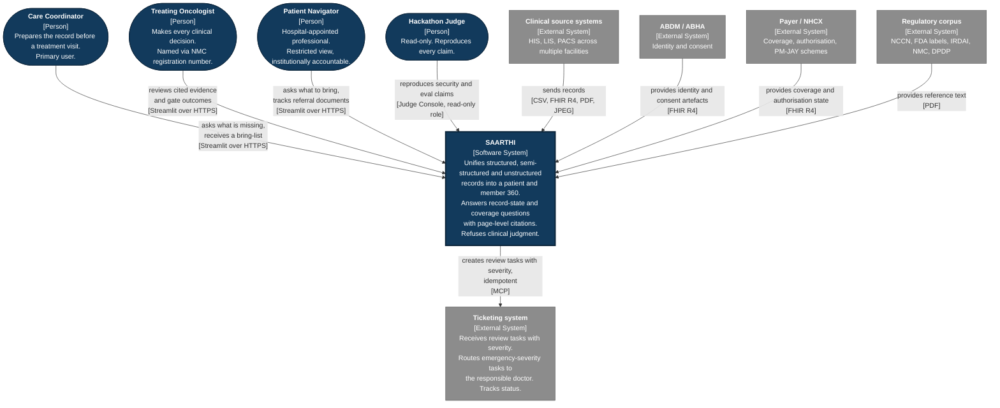

**Two things a judge should take from this diagram.**

**Every user is a medical professional.** The system is exclusively professional-facing. `patient_navigator` is a hospital-appointed role — institutionally accountable, employed by the facility, with a `practitioner_id` in the governance model. No patient-side access exists. NMC Telemedicine Practice Guidelines 2020 compliance is structural: every `CURRENT_USER()` resolves to a professional with institutional accountability, not by policy instruction but by the absence of any non-professional user path. The real patient whose 19 reports informed this design was coordinated by her son across four facilities — the navigator role is modelled on exactly that function, moved inside the hospital's governance boundary.

**Only one arrow leaves SAARTHI carrying an action** — `create_review_task` to the ticketing system, and it is idempotent. Everything else is read. A system that answers questions about a patient should not be able to change her care, and the container diagram shows that this is structural rather than a policy.

---

## 3. Containers — C4 Level 2

> **Type** — C4 Level 2, container · **Scope** — inside SAARTHI: every separately deployable or runnable unit and every data store · **Audience** — technical. This is the most useful single diagram in the set.

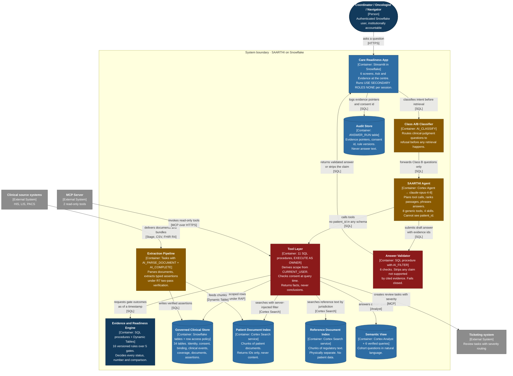

### Reading the container diagram

**The Tool Layer is red because it is the choke point.** Every path from the agent to data goes through it, and it is the only place scope is derived. There is no arrow from `agent` to `core`. That absence is the single most important line *not* in this diagram.

**The Agent is amber and the Engine is blue, and no arrow between them carries a decision.** The agent asks the tool layer for gate outcomes; the engine computes them in SQL against a versioned rule. The agent phrases the result. R1 is a shape in the diagram, not a promise in a README.

**Two Cortex Search services, not one with a filter.** R6. If patient text and guideline text share a ranked list, a guideline sentence can be cited as evidence about a patient — the most dangerous failure mode in clinical RAG. Two of four surveyed competitors mix them, confirmed in their source.

**The Class A/B classifier sits before the agent, not inside it.** A refusal that depends on the agent choosing to refuse is not a control. Putting it upstream means a clinical-judgment question never reaches retrieval at all.

---

## 4. Components — Evidence & Readiness Engine — C4 Level 3

> **Type** — C4 Level 3, component · **Scope** — inside the *Evidence and Readiness Engine* container only. Other containers are shown as boundaries, not decomposed. · **Audience** — technical

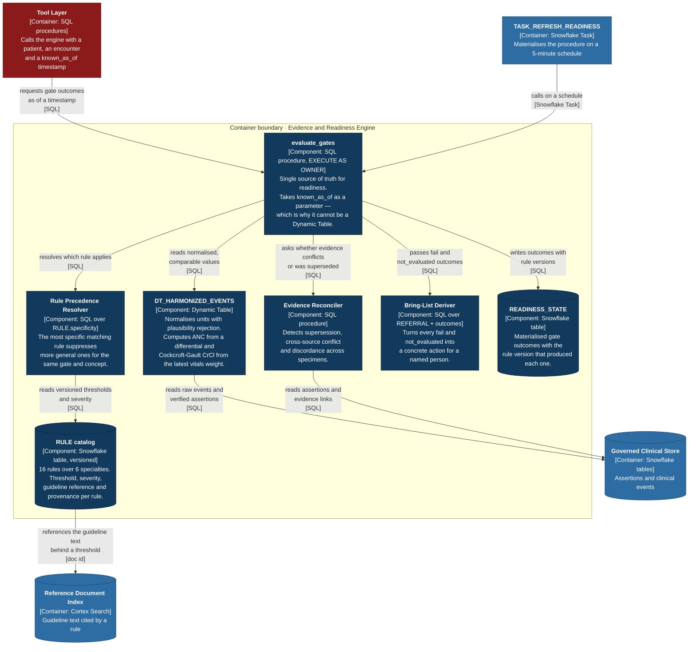

### **Why this decomposition and not another**

**Every component here is blue. There is no AI in this container at all.** That is the point of drawing it: the container that decides whether a patient is ready to receive chemotherapy contains no model. A reviewer can verify R1 by checking that this one diagram has no amber box.

`evaluate_gates` **is a procedure, not a Dynamic Table — ADR-005.** It needs `known_as_of` as a parameter, and a Dynamic Table cannot take one. An earlier draft had both a procedure *and* a DT materialising the same logic, which meant the rules existed in two places and would drift. `TASK_REFRESH_READINESS` calls the procedure instead. One source of truth.

`DT_HARMONIZED_EVENTS` **is what makes the rules simple.** It computes **ANC as** `WBC × (neutrophil% + band%) / 100` when a lab reports only a differential — which the real patient's lab did — so `CLIN-ANC-001` compares a number that the source document never printed. Unit normalisation with plausibility rejection lives here too: `GM%` to `g/dL`, `/CUMM` to `/µL`.

`Bring-List Deriver` **is the component that makes the system useful rather than merely correct.** A gate that says `not_evaluated` is a diagnosis; a bring-list that says *"obtain the final histopathology report from Facility B, ask for Dr Rao"* is a treatment. Every `fail` and `not_evaluated` becomes an action addressed to a named person.

---

## 5. Deployment

> **Type** — Deployment · **Scope** — Snowflake account `FV11738`, region `GCP_ME_CENTRAL2`, Enterprise Edition · **Audience** — whoever creates the objects
>
> **Two views.** 5a shows *where every object lives*. 5b shows *what order to create them in*. You need both: 5a to understand the system, 5b to build it.

### 5a — Where everything lives

**Runtime call paths only.** Creation dependencies are in 5b. Edge labels are deliberately omitted — every call path is named in the table directly below, which keeps the diagram legible at any zoom level.

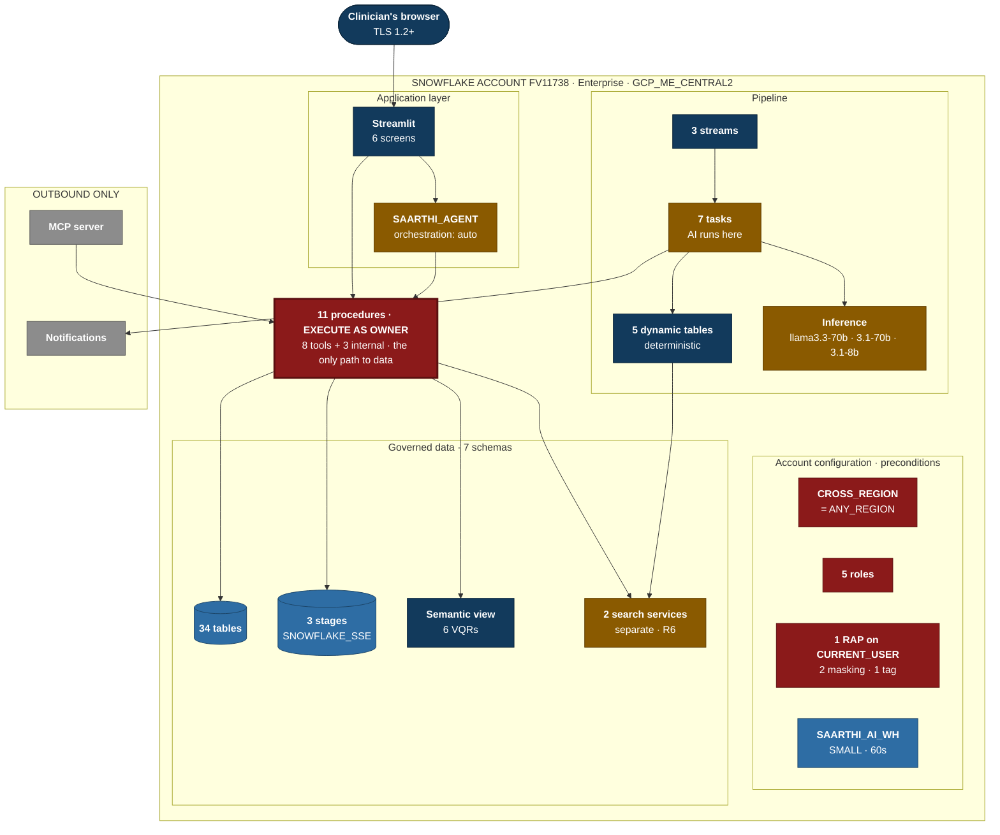

### The call paths

| From | To | What happens |
|---|---|---|
| Browser | Streamlit | HTTPS. Session immediately runs `USE SECONDARY ROLES NONE`. |
| Streamlit | Agent | Class B questions only. Class A is refused upstream by the classifier. |
| Streamlit | Procedures | Direct calls for `bind_patient` and screen data |
| Agent | Procedures | `generic` tools only. **`patient_id` is absent from every tool input schema.** |
| Procedures | Tables | Reads under the row access policy |
| Procedures | Stages | Reads document files |
| Procedures | Semantic view | Cohort questions via Cortex Analyst |
| Procedures | Search services | Query with a server-injected `@eq` filter, returns chunk IDs only |
| Streams | Tasks | New data triggers the pipeline |
| Tasks | Inference | `AI_PARSE_DOCUMENT`, `AI_COMPLETE` pass A and pass B |
| Tasks | Dynamic tables | Deterministic transforms downstream of AI steps |
| Dynamic tables | Search services | `DT_DOC_CHUNK` feeds the index |
| Tasks | Notifications | `TASK_NOTIFY` on blocker + visit ≤ 3 days |
| MCP server | Procedures | 2 read-only tools, no patient-scoped tool exposed |

### Reading 5a

| Colour | Meaning |
|---|---|
| **Red, thin border** | Configuration. Preconditions, not participants — nothing calls them. |
| **Red, thick border** | The procedures layer. The choke point every data path goes through. |
| **Blue box** | Deterministic executable |
| **Blue cylinder** | Persistent storage |
| **Amber** | AI runs here |
| **Grey** | External, outbound only |

**Three things the diagram proves by what it does not contain:**

**No arrow from `SAARTHI_AGENT` to any data store.** The agent's only outgoing edge is to `PROC`. That absence is R5 layer 1 made structural — verified as A1, where an agent given a raw search tool derived `patient_id` from the question text and injected the filter itself.

**`TASK` is amber, `DT` is blue, and they are adjacent.** AI functions cannot run inside a Dynamic Table. Every AI step is a Task; every deterministic step is a DT. The platform constraint and R1 point the same direction.

**The red configuration boxes have no edges at all.** They are not in the call graph. The account parameter does not send anything to the inference endpoints — it makes them reachable. Their creation order is 5b.

### 5b — What order to create things

An object cannot be created before everything it depends on exists. This graph is the structure of `setup.sql`.

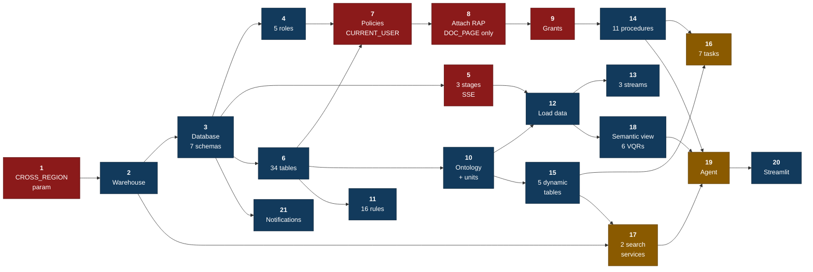

**Red steps fail silently or catastrophically if done wrong.** Steps 1, 5, 7, 8, 9 — each has a verified platform finding behind it. Get one wrong and the failure surfaces somewhere unrelated, days later.

### Step reference

| # | Step | DDL | Depends on | The thing that will bite you |
|---|---|---|---|---|
| 1 | Account parameter | `ALTER ACCOUNT SET CORTEX_ENABLED_CROSS_REGION = 'ANY_REGION'` | — | **`GCP_ME_CENTRAL2` has no local `AI_COMPLETE`.** Without this, every AI call fails. Line one of `setup.sql`. |
| 2 | Warehouse | `CREATE WAREHOUSE SAARTHI_AI_WH WAREHOUSE_SIZE='SMALL' AUTO_SUSPEND=60` | 1 | Search services name a warehouse at creation time — it must exist first. |
| 3 | Database + schemas | `CREATE DATABASE SAARTHI` · `CREATE SCHEMA` ×7 | 2 | `CORE · DOCUMENTS · EVIDENCE · OPERATIONAL · GOVERNANCE · STAGES · EVAL` |
| 4 | Roles | `CREATE ROLE` ×5 | 3 | Policies and grants reference roles by name. Create before policies. |
| 5 | Stages | `CREATE STAGE … ENCRYPTION = (TYPE = 'SNOWFLAKE_SSE') DIRECTORY = (ENABLE = TRUE)` | 3 | **F9 — AI functions cannot read `SNOWFLAKE_FULL`, user stages (`@~`), or table stages (`@%tbl`).** Wrong encryption fails at parse time, not at create time. |
| 6 | Tables | `CREATE TABLE` ×34 | 3 | No policies attached yet. See `SPEC.md` §2, diagrams 9 and 10. |
| 7 | Policies | `CREATE ROW ACCESS POLICY` + `CREATE MASKING POLICY` ×2 | 4, 6 | **F3 — the RAP must key on `CURRENT_USER()`, never `CURRENT_ROLE()`.** A role-keyed policy returns every patient inside an owner's-rights procedure and looks perfect in single-user testing. |
| 8 | Attach policies | `ALTER TABLE … ADD ROW ACCESS POLICY` | 7 | **F4 — `DOC_PAGE` gets the policy. `DOC_CHUNK` gets NONE.** A Cortex Search service cannot be created over a RAP-protected table. The index returns IDs; content lives behind the policy. |
| 9 | Grants | `GRANT` statements | 4, 6, 8 | **F7 — the app role gets no `USAGE` on either search service.** And the session must run `USE SECONDARY ROLES NONE`, or a secondary `ACCOUNTADMIN` satisfies the check through the back door. |
| 10 | Ontology + units | `INSERT` into `CLINICAL_ONTOLOGY`, `UNIT_REGISTRY` | 6 | Dynamic tables read these for normalisation. Must be populated before step 15. |
| 11 | Rules | `INSERT` into `RULE_CATALOG` | 6 | 16 rules, each with `guideline_ref`, `provenance_note`, version, `severity`, `specificity`. |
| 12 | Load data | `COPY INTO` + `PUT` to stage | 5, 6, 10 | CSV, FHIR bundles, PDFs. Normalisation needs the ontology already loaded. |
| 13 | Streams | `CREATE STREAM` ×3 | 6, 12 | Directory table, FHIR staging, documents. |
| 14 | Procedures | `CREATE PROCEDURE … EXECUTE AS OWNER` ×11 | 6, 8, 9 | 8 tools + `evaluate_gates` + `bind_patient` + `validate_answer`. **No tool takes a patient selector.** |
| 15 | Dynamic tables | `CREATE DYNAMIC TABLE` ×5 | 6, 10 | **No AI functions inside a DT** — a DT requires deterministic refresh. |
| 16 | Tasks | `CREATE TASK` ×7 | 14, 15 | **The only place AI functions may run.** parse · flatten · extract · reconcile · refresh_readiness · notify · skill orchestrator |
| 17 | Search services | `CREATE CORTEX SEARCH SERVICE` ×2 | 2, 15 | Needs the warehouse and a populated `DT_DOC_CHUNK`. `TARGET_LAG = '1 minute'`. |
| 18 | Semantic view | `CREATE SEMANTIC VIEW` + 6 VQRs | 6, 12 | Explainer calls verified queries *"very very crucial."* |
| 19 | Agent | `CREATE AGENT` | 14, 17, 18 | **A1 — `patient_id` omitted from every tool input schema.** Only `generic` tools over procedures. |
| 20 | Streamlit | `CREATE STREAMLIT` | 14, 19 | 6 screens. Session runs `USE SECONDARY ROLES NONE`. |
| 21 | Notifications | `CREATE NOTIFICATION INTEGRATION` | 3 | Email + webhook for `TASK_NOTIFY`. Can be created any time after step 3. |

### The five deployment facts that are load-bearing

**1. `CORTEX_ENABLED_CROSS_REGION = ANY_REGION` is line one.** `GCP_ME_CENTRAL2` has no local `AI_COMPLETE` endpoint. Without it, nothing amber in any diagram runs. Someone reproducing this on a fresh account fails immediately.

**2. All three stages must be `SNOWFLAKE_SSE`.** AI functions cannot read `SNOWFLAKE_FULL` encryption, user stages, or table stages. Verified as F9 — discovered by hitting it, not by reading about it.

**3. The row access policy keys on `CURRENT_USER()`.** Inside an `EXECUTE AS OWNER` procedure, `CURRENT_ROLE()` becomes the *owner's* role while `CURRENT_USER()` stays the caller. A role-keyed policy is a total bypass that is invisible in single-user testing. Verified as F3.

**4. `DOC_CHUNK` carries no row access policy.** `CREATE CORTEX SEARCH SERVICE` fails with *"Change tracking is not supported on queries with correlated subquery expressions"* when the source table has a mapping-table RAP. Verified as F4 — **the platform forced the correct security architecture.**

**5. Sessions must run `USE SECONDARY ROLES NONE`.** Otherwise *"the app role has no `USAGE` on the search service"* is a false statement. Verified as F7 — an unfiltered query succeeded until secondary roles were disabled, then correctly returned `390404`.

### Cost and runtime

**One warehouse, `SMALL`, 60-second auto-suspend.** Roughly $1,200 across three accounts, $386 remaining on the primary. `AGENT_RUN` being available in the warehouse runtime means **no container runtime is required** — verified as F1. If SPCS disappoints, the warehouse path already works.

**The `SAARTHI_JUDGE` role is deployed infrastructure.** Judges spend 5–22 October alone with this repository. A read-only role that reproduces every security finding and eval result without write access is how Solution Completeness gets earned rather than asserted.

---

## 6. Trust boundaries — data flow diagram

> **Type** — Data flow diagram with trust boundaries (Microsoft SDL / Shostack convention, STRIDE-aligned) · **Scope** — data flow from an untrusted question to cited evidence, annotated with every verified leak path · **Audience** — security reviewers, judges
>
> **Diagram-specific key:** **dashed red line = trust boundary**, a point where privilege or authority changes. Numbered steps `1`–`9` are referenced in the prose below. `⚠️ Fn`/`An` marks an empirically verified finding.

```mermaid
flowchart TB
    subgraph TB1["TRUST BOUNDARY 1 — untrusted input"]
        U["Human user<br/>[External entity]<br/>Authenticated Snowflake user"]
        Q["Question text<br/>[Data flow]<br/>Free-form natural language"]
        U -->|"1 · submits"| Q
    end

    subgraph TB2["TRUST BOUNDARY 2 — application session"]
        SESS["Session hardening<br/>[Process]<br/>USE SECONDARY ROLES NONE<br/>⚠️ F7 · without this a secondary<br/>ACCOUNTADMIN satisfies the privilege check"]
        CLS["Class A/B classifier<br/>[Process]<br/>AI_CLASSIFY"]
    end

    subgraph TB3["TRUST BOUNDARY 3 — agent, treated as untrusted"]
        AG["SAARTHI Agent<br/>[Process]<br/>⚠️ A1 · given a raw search tool it derives<br/>patient_id from the question and injects<br/>the filter itself. Agent-generated filters<br/>are worthless as a scope control."]
    end

    subgraph TB4["TRUST BOUNDARY 4 — owner's-rights procedures, the only trusted code"]
        SCOPE["Selection + authorisation<br/>[Process]<br/>SELECTION · PATIENT_BINDING for CURRENT_SESSION()<br/>set by a human click, never by question text<br/>AUTHORISATION · CURRENT_USER to PRACTITIONER to CARE_TEAM<br/>⚠️ F3 · CURRENT_USER survives owner's-rights elevation"]
        CONS["Consent check<br/>[Process]<br/>Evaluated at query time, not at ingest.<br/>The binding is a record of selection,<br/>NEVER a cached authorisation."]
        INJ["Server-side filter injection<br/>[Process]<br/>@eq patient filter · ⚠️ F6"]
    end

    subgraph TB5["TRUST BOUNDARY 5 — data at rest"]
        IDX["DOC_CHUNK index<br/>[Data store]<br/>NO row access policy<br/>⚠️ F5 · Cortex Search runs with owner's rights<br/>and IGNORES row access policies.<br/>⚠️ F4 · a service cannot be created over a<br/>RAP-protected table at all.<br/>Therefore this store returns IDs, never content."]
        PAGE["DOC_PAGE content<br/>[Data store]<br/>ROW ACCESS POLICY on CURRENT_USER<br/>the only place governed content lives"]
    end

    VAL["Answer validator<br/>[Process]<br/>6 checks, strips unsupported claims"]
    OUT["Cited answer<br/>[Data flow]"]
    DENY["Empty result<br/>[Data flow]<br/>FAIL CLOSED"]

    Q -->|"2 · enters session"| SESS
    SESS -->|"3 · classify before any retrieval"| CLS
    CLS -->|"4 · Class B only"| AG
    CLS -.->|"Class A · refused here"| DENY
    AG -->|"5 · calls generic tool<br/>patient_id absent from schema"| SCOPE
    SCOPE -->|"6 · scope resolved"| CONS
    CONS -.->|"no valid consent<br/>or no care relationship"| DENY
    CONS -->|"7 · authorised"| INJ
    INJ -->|"8 · search with injected filter"| IDX
    IDX -->|"9 · IDs only, no content"| PAGE
    PAGE --> VAL
    VAL --> OUT
    VAL -.->|"claim unsupported"| DENY

    classDef enforce fill:#8b1a1a,stroke:#5a0f0f,color:#fff
    classDef store fill:#123a5c,stroke:#0b2439,color:#fff
    classDef ai fill:#8a5a00,stroke:#5c3c00,color:#fff
    classDef bad fill:#4a4a4a,stroke:#2a2a2a,color:#fff
    class SESS,SCOPE,CONS,INJ,VAL enforce
    class IDX,PAGE store
    class AG,CLS ai
    class DENY bad

    style TB1 fill:#fff8f8,stroke:#c0392b,stroke-width:2px,stroke-dasharray:6 4
    style TB2 fill:#fff8f8,stroke:#c0392b,stroke-width:2px,stroke-dasharray:6 4
    style TB3 fill:#fff8f8,stroke:#c0392b,stroke-width:2px,stroke-dasharray:6 4
    style TB4 fill:#fff8f8,stroke:#c0392b,stroke-width:2px,stroke-dasharray:6 4
    style TB5 fill:#fff8f8,stroke:#c0392b,stroke-width:2px,stroke-dasharray:6 4
```

### The four verified leak paths

Each is reproducible from a query ID in `evidence/coco/verification-query-ids.md`. **This is the strongest Technical Execution claim in the submission**, because it is a finding rather than a feature.

| ID     | The leak                                                                                                                                                                           | Why it is invisible in normal testing                                                            | Closed by                                                                                                                                                  |
| ------ | ---------------------------------------------------------------------------------------------------------------------------------------------------------------------------------- | ------------------------------------------------------------------------------------------------ | ---------------------------------------------------------------------------------------------------------------------------------------------------------- |
| **F3** | A row access policy keyed on `CURRENT_ROLE()` returns **every patient** inside an `EXECUTE AS OWNER` procedure, because the role becomes the *owner's* role.                       | With one test user, the owner *is* the caller, so the policy appears to work perfectly.          | Policy keys on `CURRENT_USER()`, which stays the caller through elevation. Step 6.                                                                         |
| **F5** | Cortex Search runs with owner's rights and **ignores row access policies entirely** — it returned another patient's pathology text despite a correct policy on the governed table. | The policy is present and correct on the table. The leak is in the retrieval path, not the data. | Index holds no content. Server-side `@eq` filter, then join IDs back to the RAP-protected store. Steps 8–9.                                                |
| **F7** | *"The app role has no* `USAGE`*"* is a **false statement** while secondary roles are active — a secondary `ACCOUNTADMIN` satisfies the check through the back door.                | The `GRANT` audit looks correct. The privilege arrives from a role nobody was looking at.        | `USE SECONDARY ROLES NONE` on every session, or a dedicated service user. Step 2.                                                                          |
| **A1** | Given a raw `cortex_search` tool, the agent **derives** `patient_id` **from the question text** and injects the filter itself.                                                     | It produces correct answers in testing, because the question usually names the right patient.    | Only `generic` tools over procedures, and `patient_id` **omitted from every tool input schema — unreachable by construction, not by instruction.** Step 5. |

**Why the agent sits inside its own trust boundary and is treated as untrusted.** A1 is the reason. An agent that can compose a filter can compose the *wrong* filter, and no amount of prompt instruction changes that. The only durable fix is to remove the parameter from the interface. **Trust boundary 3 exists because the agent is not trustworthy, and saying so plainly is more defensible than claiming it is well-prompted.**

**Every dotted line in this diagram terminates at** `FAIL CLOSED`**.** There is no pass-by-default path anywhere. If `AI_FILTER` errors, the claim is stripped. If consent is absent, the result is empty. If extraction pass B fails, no value is asserted.

We did not see any of the four closed in the competitor code we reviewed. Two ship access control that is a Streamlit radio button writing to `st.session_state` — confirmed in their source, with their own comment admitting it.

---

## 7. Dynamic — question to cited answer

> **Type** — Dynamic (sequence style) · **Scope** — the primary use case: a coordinator asks a record-state question · **Audience** — everyone

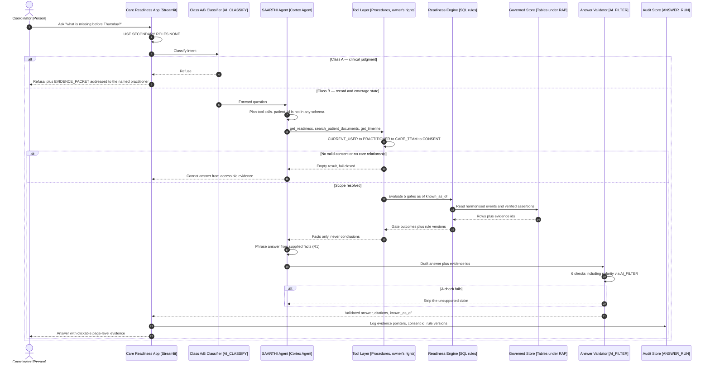

### Three properties visible in the sequence

**The tool layer returns facts, never conclusions.** Look at the message from `T` back to `AG`. The engine computed the gate outcomes; the agent phrases them. R1 is one message label in this diagram.

`ANSWER_RUN` **stores pointers, not content — ADR-009.** DPDP s.12(3) requires erasure on withdrawal of consent; Rule 6(e) requires a one-year audit log. Storing answer *text* makes those obligations collide irreconcilably — you cannot both keep the log and erase the data. Storing evidence *pointers* satisfies both: the log survives, the content dies with the source. **This is a schema constraint derived from a legal one**, and it is the kind of thing that only appears if someone reads the statute rather than a summary.

**Consent is checked inside the request, not at load time.** Revocation must take effect immediately, which is impossible if consent was resolved once at ingest. This is a 30-second demo: same user, same question, revoke consent, ask again, get nothing.

---

## 8. Dynamic — document to verified assertion (R7)

> **Type** — Dynamic (collaboration style, numbered) · **Scope** — one page of one document becoming one asserted or refused value · **Audience** — technical
>
> **Why this diagram exists:** R7 is a differentiator not found in the competitor code we reviewed. It deserves its own runtime view.

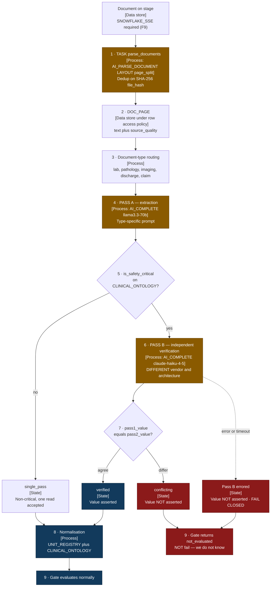

### Why two different model families and not the same model twice

Running `llama3.3-70b` twice **correlates its errors** — the same architecture misreads the same degraded glyph the same way, and agreement between two runs of one model measures nothing except its own confidence. Pass B on `claude-haiku-4-5` makes the failure modes independent: different vendor, different architecture, different training data.

⚠️ **Corrected 20 Sept.** Pass B was originally `llama3.1-70b`, described here as a different family. **It is not** — Llama 3.3 70B and Llama 3.1 70B are the same Meta lineage separated by post-training, so the independence this diagram claims did not exist. `llama3.1-70b` has also since been marked `[legacy]`. `AI-INTEGRATION-ARCHITECTURE.md` §1.1 carries the full reasoning; the correction is recorded rather than edited away because a failure-and-fix pair is the most credible lifecycle evidence available.

**Same-model self-consistency measures confidence. Cross-family disagreement measures correctness.** That distinction is the whole of R7.

**Cost is spent where harm lives.** Only concepts flagged `is_safety_critical` on `CLINICAL_ONTOLOGY` get pass B. A platelet count gets two reads; a patient's address gets one.

**The demo beat:** hand the system a rotated photograph of a CBC where the platelet count is genuinely ambiguous. The passes disagree. The system says *"two reads of this page disagree on the platelet value — a human must confirm"*, and the gate returns `not_evaluated`. **It refuses to assert a number it cannot verify.** The competitor projects we reviewed appeared to assert whatever their single pass returned, with no mechanism to know it was wrong.

`not_evaluated` is not `fail`. An unverifiable lab does not mean the count is low — it means we do not know, and those two states demand different actions.

---

## 9. ERD — identity, organisation, consent

> **Type** — Entity relationship diagram, crow's-foot notation · **Scope** — the subject area that answers *who may see what*. Clinical entities are in diagram 10. · **Audience** — technical, clinical governance
>
> **Diagram-specific key:** `||--o{` means one-to-many. `PK` primary key, `FK` foreign key. Quoted text after an attribute is its permitted value set or purpose.

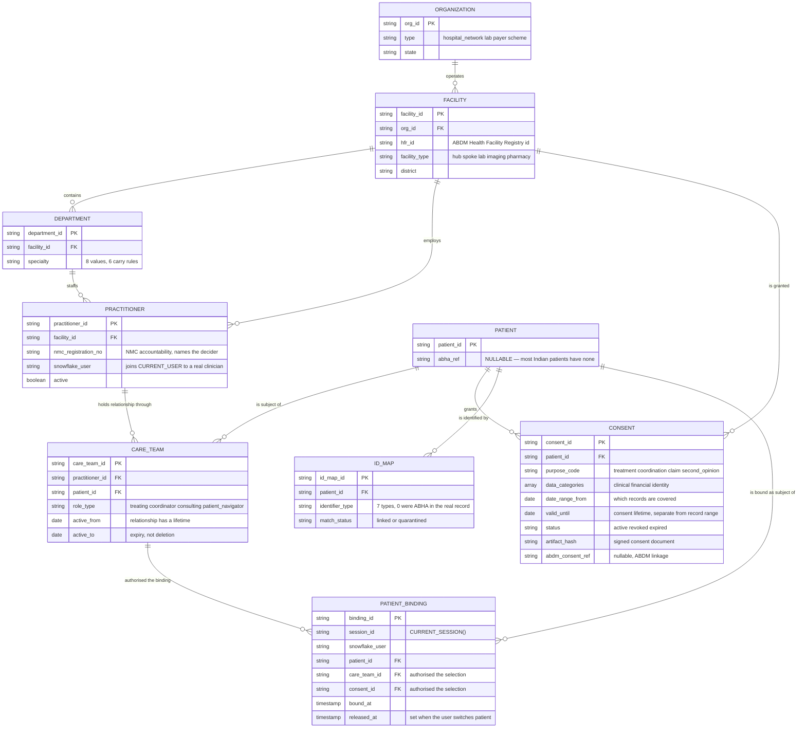

### Four modelling decisions worth defending

`CARE_TEAM` **replaces a flat user-to-patient map.** A care relationship has a facility, a role type, and a lifetime. A consulting cardiologist who saw the patient once in March should not have access in November, and `active_to` makes that expressible. A flat map cannot express it at all, so systems built on one either over-grant permanently or delete history.

**Consent has two independent date ranges, and conflating them is a common bug.** `date_range_from`/`to` says *which records* the consent covers. `valid_from`/`valid_until` says *how long the consent itself lives*. A consent granted in June for records from January, expiring in December, needs both. One range cannot express it.

`abha_ref` **is nullable, and that is the design centre of R4 rather than an edge case.** Across the 19 real reports studied, **seven distinct patient identifiers appeared and none of them was an ABHA number.** A system that assumes ABHA is present fails on the common case in India. `ID_MAP` with a `quarantined` status is the consequence: an ambiguous match contributes **no** evidence rather than a guess.

**There is no `HOUSEHOLD` entity, and that is a stated scope boundary.** PM-JAY is ₹5 lakh per family per year, and base FHIR `Coverage.beneficiary` is a single Patient reference — so a family limit has no native representation. Modelling it correctly needs a household entity, household-keyed coverage, and member-centric aggregation, none of which is verified against the NRCeS IG. **We declare it out of scope rather than ship an unverified workaround.** `COVERAGE.is_family_floater` records that a shared limit exists; `COV-LIMIT-001` evaluates the patient-level figure only, and the UI says so. The brief asks for *"patient **or** member 360"* — patient 360 satisfies it. See `DECISION-household-removal.md`.

---

## 10. ERD — clinical events, documents, evidence

> **Type** — Entity relationship diagram, crow's-foot notation · **Scope** — the subject area that answers *what we know and how we know it* · **Audience** — technical, clinical

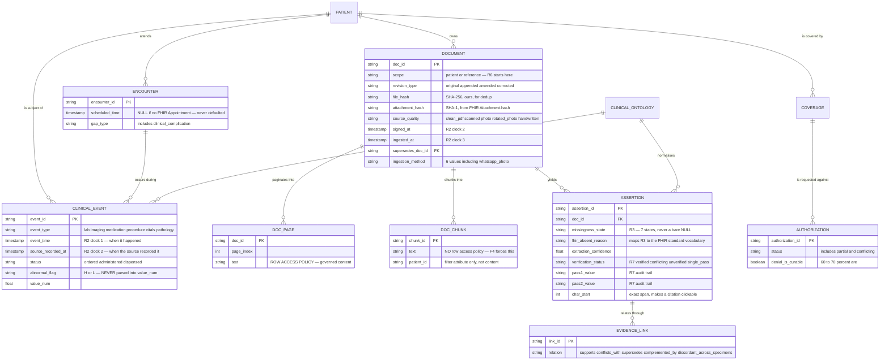

### Four things here that were not found in the competitor code we reviewed

**The** `DOC_PAGE` **/** `DOC_CHUNK` **split is platform-forced — ADR-003.** Verified: `CREATE CORTEX SEARCH SERVICE` fails with *"Change tracking is not supported on queries with correlated subquery expressions"* when the source table carries a mapping-table row access policy. So the index must be un-governed and return IDs only, while content lives behind the policy. **The platform forced the correct security architecture**, and we found that out by trying it rather than by reasoning about it.

`revision_type` **distinguishes an append from a correction.** The real patient's FISH result arrived as an *"ADDITIONAL REPORT"* appended two weeks after the IHC. FHIR `DiagnosticReport.status` separates `appended` from `amended`/`corrected` for good reason: an append **completes** the record, a correction means **a prior decision may have rested on a wrong value.** An earlier draft collapsed both into `supersedes_doc_id` and lost the difference that matters clinically.

`discordant_across_specimens` — the outside biopsy read Grade II / HER2 IHC 1+; the surgical specimen read Grade III / IHC 2+. Different accession IDs, so specimen-keyed matching never collides and no naive system detects anything wrong. Yet **this is the finding that triggered FISH and changed her treatment.** It is neither a match nor an error. It needs a third relation type, and nobody in the field models one.

`abnormal_flag` **is separate from** `value_num`**.** Indian lab PDFs print `10.3 L` and `38 H`. Parsing the flag into the number corrupts every downstream threshold comparison, silently, in the direction of looking normal.

---

## 11. Pipeline topology

> **Type** — Data flow diagram, layered by execution semantics · **Scope** — ingest through to materialised readiness state · **Audience** — technical
>
> **Diagram-specific key:** amber = a Task, because AI functions can only run there. Blue = a Dynamic Table, because the step is deterministic.

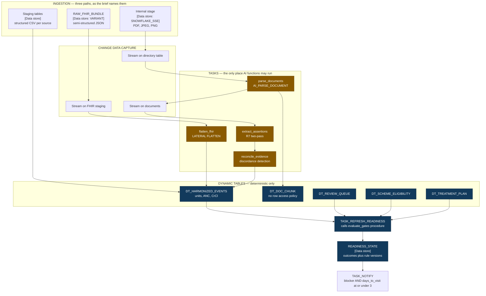

**Why the Task / Dynamic Table split is a constraint, not a preference — ADR-006.** AI functions cannot run inside a Dynamic Table; `AI_PARSE_DOCUMENT` and `AI_COMPLETE` are non-deterministic and a DT requires deterministic refresh. So every AI step is a Task and every deterministic step is a Dynamic Table. Five DTs, six Tasks, three Streams — and the boundary between amber and blue in this diagram is exactly the boundary R1 requires anyway. **The platform's constraint and the architecture's rule point the same direction.**

### Layer-by-layer walkthrough

**Ingestion — three paths, as the brief names them.** Each path serves a different real-world source:

- **Internal stage (SNOWFLAKE_SSE)** — files uploaded directly: PDFs of lab reports, scanned discharge summaries, photographs of prescriptions. Encryption must be `SNOWFLAKE_SSE` because AI functions cannot read `SNOWFLAKE_FULL`, user stages, or table stages (verified platform fact F9).
- **RAW_FHIR_BUNDLE (VARIANT)** — semi-structured JSON from hospitals that send FHIR R4 bundles. Stored as Snowflake's VARIANT type, which preserves the full nested structure without schema-on-write.
- **Staging tables** — structured CSV feeds from hospital information systems (admissions, encounters, lab results in tabular form).

**Change Data Capture — three Streams as triggers.** Each Snowflake Stream watches one ingestion target and detects new rows since the last consumption. This is what makes the pipeline incremental — a new PDF landing on stage triggers parsing without reprocessing everything:

- **Stream on directory table** — fires when new files appear on the internal stage. The directory table is a Snowflake metadata table that tracks files on a stage.
- **Stream on FHIR staging** — fires when new JSON bundles are inserted into the FHIR staging table.
- **Stream on documents** — fires when new `DOCUMENT` rows are created (by either of the first two paths), triggering extraction.

**Tasks — the only place AI functions may run.** Four tasks in sequence, each doing one thing:

- **`parse_documents` (AI_PARSE_DOCUMENT)** — converts PDFs and images into pages of text. Uses `LAYOUT page_split` mode to preserve page boundaries, which matters because citations must point to a specific page. Deduplicates on SHA-256 `file_hash` before parsing.
- **`flatten_fhir` (LATERAL FLATTEN)** — explodes nested FHIR JSON into flat rows. One JSON bundle containing a CBC with 15 analytes becomes 15 rows in `CLINICAL_EVENT`, each with its own `concept_id`, `value_num`, `unit`, and all three R2 timestamps.
- **`extract_assertions` (R7 two-pass)** — the differentiator. Runs two independent AI extractions on safety-critical fields using genuinely different model families (`llama3.3-70b` for pass A, `claude-haiku-4-5` for pass B — corrected 20 Sept, see §1.1). Agreement → `verified`. Disagreement → `conflicting` → the gate returns `not_evaluated`, never a guess.
- **`reconcile_evidence` (discordance detection)** — compares assertions across documents for the same patient and concept. Detects when two sources say different things about the same fact (e.g., two biopsies giving different HER2 results from different specimens — `discordant_across_specimens`).

**Dynamic Tables — deterministic only.** Five DTs that auto-refresh when upstream data changes. Pure SQL, no models:

- **`DT_HARMONIZED_EVENTS`** — the normalisation layer. Converts source units to canonical units via `UNIT_REGISTRY` (e.g., `GM%` → `g/dL`, `/CUMM` → `/µL`), rejects implausible values, and computes derived metrics: ANC from differential (`WBC × (neutrophil% + band%) / 100`) and CrCl via Cockcroft-Gault formula using the latest vitals weight.
- **`DT_DOC_CHUNK`** — splits parsed pages into search-ready chunks for the Cortex Search index. Carries no row access policy because Cortex Search cannot index a RAP-protected table (F4).
- **`DT_REVIEW_QUEUE`** — surfaces items needing human attention: R7 conflicts, missing documents from referrals, curable insurance denials, unreadable uploads.
- **`DT_SCHEME_ELIGIBILITY`** — computes PM-JAY and insurance coverage status per patient from `COVERAGE.annual_limit` and `used_amount`, with `COVERAGE.priority` for primary/secondary payer sequencing. Patient-level only — family-floater arithmetic is out of scope and declared as such.
- **`DT_TREATMENT_PLAN`** — materialises the current treatment plan with cycle count, regimen, intent, and plan version history.

**The final step — readiness materialisation and notification:**

- **`TASK_REFRESH_READINESS`** — runs the `evaluate_gates` stored procedure against all 16 rules for each patient whose upstream data changed. Cannot be a Dynamic Table because `evaluate_gates` takes `known_as_of` as a parameter.
- **`READINESS_STATE`** — the output table. Stores per-patient, per-gate outcomes (`pass | fail | not_evaluated | conflicting`) with the rule version that produced each outcome. This is what `get_readiness` reads when the copilot answers "what gates are failing?"
- **`TASK_NOTIFY`** — fires a notification (email + webhook) when a gate outcome is `blocker` severity AND the patient's next visit is 3 days away or fewer. The notification names the responsible practitioner.

---

## 12. State — assertion verification lifecycle

> **Type** — State machine (UML statechart) · **Scope** — one assertion from extraction to supersession · **Audience** — technical
>
> **Why a state diagram:** `verification_status` and `missingness_state` are not decorations. They are a lifecycle with legal transitions, and drawing it prevents a value from being asserted through a path nobody intended.

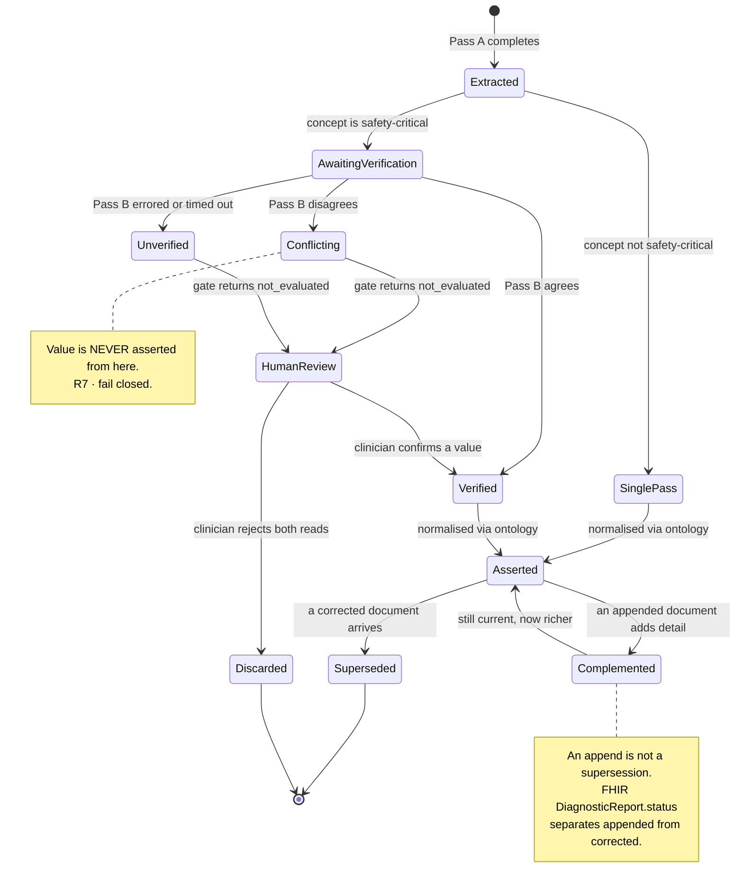

**The transition that does not exist is the important one.** There is no edge from `Conflicting` or `Unverified` to `Asserted`. A value cannot reach the asserted state without either cross-family agreement or an explicit human confirmation. **R7 is enforced by the absence of a transition**, which is a stronger guarantee than a validation rule that someone could bypass.

`HumanReview` returning to `Verified` is what keeps the system usable. Refusing to assert a value is only acceptable if there is a path to resolution; otherwise the system degrades into an unhelpful sceptic.

---

## 13. State — document revision lifecycle

> **Type** — State machine · **Scope** — one clinical document across revisions, aligned to FHIR `DiagnosticReport.status` · **Audience** — technical, clinical

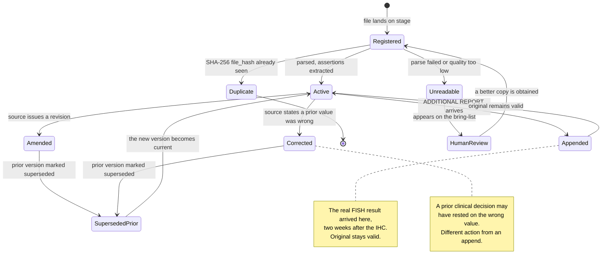

`Unreadable` **routes to the bring-list rather than to a dead end.** A rotated photograph of a discharge summary that no model can read is not a system failure to be logged and forgotten — it is a **concrete task**: obtain a legible copy from a named facility. This is the difference between a system that reports problems and one that resolves them.

### State-by-state explanation

**`Registered`** — a file has landed on the internal stage and a `DOCUMENT` row exists with metadata (doc_type, source_facility, ingestion_method), but no text has been extracted yet. This is the entry point for all three ingestion paths.

**`Duplicate`** — SHA-256 `file_hash` matches an existing document. Terminal state. The system does not re-parse a file it has already seen. This matters because the same report is routinely sent by multiple paths (printed copy photographed by the navigator, PDF downloaded from the HIS, and attached to a FHIR bundle). Without dedup, the same lab value would appear three times in the evidence and inflate the apparent confirmation count.

**`Unreadable`** — `AI_PARSE_DOCUMENT` failed or `source_quality` is too low (e.g., a severely rotated photograph with no legible text). The document appears on the review queue with the action *"obtain a legible copy from [facility name]"*. If a better copy arrives, it re-enters at `Registered`.

**`Active`** — the current, valid version of this document. Assertions have been extracted and (for safety-critical fields) verified under R7. This is the state where the document contributes evidence to gate evaluations.

**`Appended`** — an *"ADDITIONAL REPORT"* arrives that adds information to the original without invalidating it. The real patient's FISH result arrived this way — two weeks after the initial IHC, as a separate addendum to the same surgical pathology report. The original document **stays valid** (its IHC findings still hold). FHIR `DiagnosticReport.status` = `appended`. The new information is extracted and linked via `EVIDENCE_LINK.relation = complemented_by`.

**`Amended` / `Corrected`** — the source institution issues a revision that supersedes the prior version. The critical distinction: an amendment means *"we have more information"*; a correction means *"a value we previously reported was wrong."* A correction triggers re-evaluation of any gate that depended on the superseded value, because **a prior clinical decision may have rested on wrong data.** FHIR distinguishes these explicitly, and so must we.

**`SupersededPrior`** — the old version of an amended or corrected document. Marked `superseded` so it no longer contributes evidence, but retained for audit trail. `EVIDENCE_LINK.relation = supersedes` connects the new version to the old.

### Why this lifecycle matters for the competition

Every surveyed competitor treats documents as immutable blobs. A correction arrives and both versions live side by side, with no mechanism to mark the old one as wrong. The consequence: a gate evaluates against stale or incorrect data, and nobody knows. This lifecycle makes supersession, append, and correction **structurally distinct operations with different downstream effects** — exactly what a judge spending 18 days with the repo will look for when testing data quality claims.

---

## 14. Decision — Class A / Class B routing

> **Type** — Decision flow · **Scope** — classification of every incoming question against the NMC legal boundary · **Audience** — everyone, especially clinical governance
>
> NMC Telemedicine Practice Guidelines 2020 prohibit AI platforms from clinical counselling or prescribing. The registered practitioner remains solely accountable. **This is a legal boundary, not a product preference.**

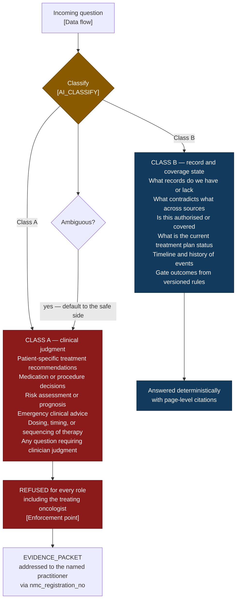

**Refused for every role, including the oncologist.** A refusal that a senior enough user can override is not a control. The NMC boundary does not move with seniority.

**Never output a confidence percentage.** Report the observed evidence state instead: *"final report not received"*, *"two sources disagree"*, *"3 claims verified against 5 sources"*. **A percentage invites a clinical decision; an evidence state invites a human to look.** This is the difference between a system that respects the boundary and one that decorates it.

**The refusal is not a dead end.** It produces an `EVIDENCE_PACKET` addressed to a **named** practitioner. `law-medical-records.md` establishes adverse inference from record gaps, so when the system says *"your treating team decides"*, it must name them and hand them something usable.

### Classification criteria — when a question becomes Class A

A question is Class A when **any** of the following apply:

| Criterion | Examples | Why it is Class A |
|---|---|---|
| **Patient-specific treatment recommendation** | "Should she proceed with cycle 4?" · "Is it safe to start chemo?" · "Should we switch to a different regimen?" | The answer requires clinical judgment about *this patient's* situation. Only the registered practitioner may make this call under NMC TPG 2020. |
| **Medication or procedure decision** | "What dose of carboplatin?" · "Should we add trastuzumab?" · "Is she a candidate for surgery?" | Prescribing and procedural decisions are explicitly prohibited for AI platforms. |
| **Risk assessment or prognosis** | "What is her prognosis?" · "How likely is recurrence?" · "What are the risks of delaying?" | Any statement about future clinical outcome requires clinical judgment. The system reports evidence state, never likelihood. |
| **Emergency clinical advice** | "She has a fever of 39°C, what should we do?" · "Her ANC dropped to 200, is this an emergency?" | Emergency triage requires immediate clinical judgment. The system can report the value; it cannot advise on the response. |
| **Dosing, timing, or sequencing** | "When should the next cycle start?" · "How long should we wait after surgery?" | Scheduling therapy is a clinical decision, even when informed by guidelines. The system reports the rule (`SURG-CLEAR-001: 21-day interval`); it does not say "therefore proceed." |
| **Ambiguous — could be either** | "Is she ready?" (could mean record-readiness or clinical readiness) | Defaults to Class A. The safe side is refusal. |

### When a question is Class B

A question is Class B when it asks about **observable state** that can be answered from records, rules, and citations without clinical judgment:

| Category | Examples |
|---|---|
| **Record completeness** | "What documents are missing?" · "Do we have the final pathology report?" · "What's on the bring-list?" |
| **Source contradiction** | "Do the two biopsy reports agree on HER2?" · "Is there a discrepancy in the staging?" |
| **Coverage and authorisation** | "Is the pre-auth approved?" · "What's the remaining PM-JAY balance?" · "Is the denial curable?" |
| **Treatment plan status** | "What cycle are we on?" · "What changed since the last visit?" · "What regimen was decided at tumour board?" |
| **Timeline and history** | "When was the last LVEF?" · "What happened between cycle 2 and 3?" |
| **Gate outcomes** | "What gates are failing?" · "Why is the readiness state not_evaluated?" — these are SQL results from versioned rules, not judgments |

**The boundary test:** if the answer requires the word *"should"*, it is Class A. If the answer can be phrased as *"the record shows"* or *"the rule returns"*, it is Class B.

---

## 15. Decision — gate outcomes

> **Type** — Decision flow · **Scope** — how one rule against one patient produces one of four outcomes, and what each outcome demands · **Audience** — clinical, technical

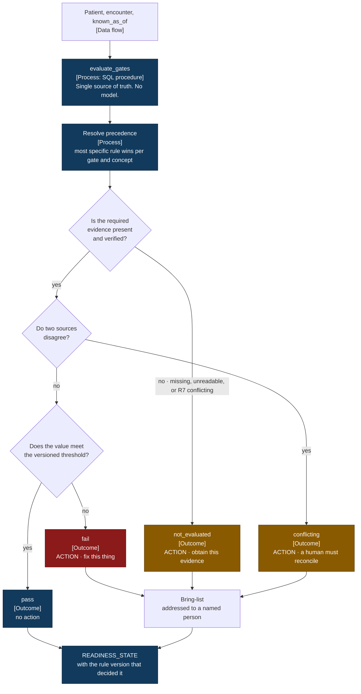

### Why four outcomes and not two

`not_evaluated` **is not** `fail`**, and collapsing them destroys the information the coordinator needs.** A missing ANC does not mean the count is low — it means we do not know. `fail` says *fix this thing*; `not_evaluated` says *obtain this evidence*; `conflicting` says *a human must reconcile two sources*. Three different people do three different jobs. A boolean gate cannot dispatch any of them.

### The 16 rules behind this flow

| Specialty        | Rules                                                                                               | Provenance                           |
| ---------------- | --------------------------------------------------------------------------------------------------- | ------------------------------------ |
| Medical oncology | 5 — ANC ≥1500, platelets ≥100k, HER2 FISH if IHC 2+, final pathology present, biomarker discordance | NCCN/ASCO, ASCO-CAP 2018             |
| Cardiology       | 2 — LVEF within 90 days, FDA decline criteria                                                       | FDA label, NCCN                      |
| Nephrology       | 1 — CrCl per agent, Cockcroft-Gault                                                                 | NCCN, FDA                            |
| Hepatology       | 1 — bilirubin and AST per agent                                                                     | FDA label                            |
| Endocrinology    | 2 — `ENDO-HBA1C-001`, `ENDO-DEXA-001`                                                               | CPOC 2022, NCCN v4.2024              |
| General surgery  | 1 — `SURG-CLEAR-001`                                                                                | FDA label plus ⚠️ practice consensus |
| Cross-cutting    | 4 — coverage ×2, identity ×2                                                                        | —                                    |

**Three provenance decisions that matter more than the rule count.**

**HbA1c is** `advisory`**, never a blocker.** CPOC 2022 and the Association of Anaesthetists both state that cancer surgery should *not* be deferred for glycaemic optimisation — oncologic delay risk outweighs it. A gate that blocked here would be clinically wrong. It also returns `not_evaluated` where a haemoglobinopathy is recorded, because thalassaemia trait is prevalent in India and makes HbA1c unreliable.

**Where NCCN and ASCO disagree on DEXA intervals, we take the tighter one.** NCCN says annually for osteopenia on an aromatase inhibitor; ASCO permits one to two years. We implement 12 months, because the failure mode of this gate is a missed surveillance scan.

**Only the anti-VEGF 28-day post-operative interval is a hard gate** — it is FDA-label mandated. The general 21-day interval is **practice consensus, not guideline**; no guideline mandates a universal number. It is labelled as such everywhere it surfaces. **Presenting institutional practice as a guideline mandate would be the same dishonesty we document in competitors.**

---

## Self-review against the C4 checklist

Brown's checklist, answered honestly for this set.

| Check                                                  | Status                                                                                                                                                       |
| ------------------------------------------------------ | ------------------------------------------------------------------------------------------------------------------------------------------------------------ |
| Does every diagram have a title?                       | **Yes** — inside the diagram for C4 types, in the blockquote header for all others                                                                           |
| Is the diagram type understandable?                    | **Yes** — declared in every blockquote header                                                                                                                |
| Is the diagram scope stated?                           | **Yes** — declared in every blockquote header                                                                                                                |
| Does every diagram have a key/legend?                  | **Yes** — master key at the top, plus diagram-specific keys on 6, 9, 11                                                                                      |
| Does every element have a name?                        | **Yes**                                                                                                                                                      |
| Is the type of every element clear?                    | **Yes** — C4 renders `[Container: tech]`; other diagrams carry explicit `[Process]`, `[Data store]`, `[Outcome]`, `[State]` labels                           |
| Do you understand what every element does?             | **Yes** — every C4 element carries a description; flowchart nodes carry a purpose line                                                                       |
| Are technology choices shown?                          | **Yes** — on elements and on relationships                                                                                                                   |
| Are all acronyms explained?                            | **Yes** — ABDM, ABHA, HFR, NMC, DPDP, PM-JAY, NHCX, RAP, DFD, ANC, CrCl, LVEF, IHC, FISH, DEXA, CPOC explained at first use in `SPEC.md` and in context here |
| Is the meaning of all colours stated?                  | **Yes** — master key                                                                                                                                         |
| Is the meaning of all shapes stated?                   | **Yes** — master key                                                                                                                                         |
| Is the meaning of all border styles stated?            | **Yes** — master key, including dashed red for trust boundaries                                                                                              |
| Does every arrow have a label describing intent?       | **Yes** on diagrams 1–8. **Partial** on 11–15, where a labelled sequence would add noise to a linear flow; step numbers carry the ordering instead           |
| Does the description match the relationship direction? | **Yes** — checked on every relationship                                                                                                                      |
| Is the meaning of all line styles stated?              | **Yes** — solid for normal flow, dotted for error and failure paths                                                                                          |

**One honest partial.** On diagrams 11 through 15 not every arrow carries a text label. On a strictly linear pipeline or decision flow, labelling every edge *"then"* reduces legibility rather than improving it, so ordering is carried by step numbers and branch labels instead. Every **branching** edge is labelled on every diagram, which is where ambiguity actually lives.

### What these diagrams are for

Judges read this repository alone for 18 days before any live demo. The set exists so the three claims that decide Technical Execution are legible in under five minutes:

1. **The LLM never decides** — provable by noting that diagram 4, the component view of the container that decides readiness, contains **no amber element at all**.
2. **Extraction is verified, not trusted** — diagram 8 and diagram 12, where the absence of a transition into `Asserted` enforces R7 structurally.
3. **Scope is enforced server-side against four empirically verified leak paths** — diagram 6, with a query ID behind every finding.

Everything else in this repository is competent engineering. Those three are the reasons to win.