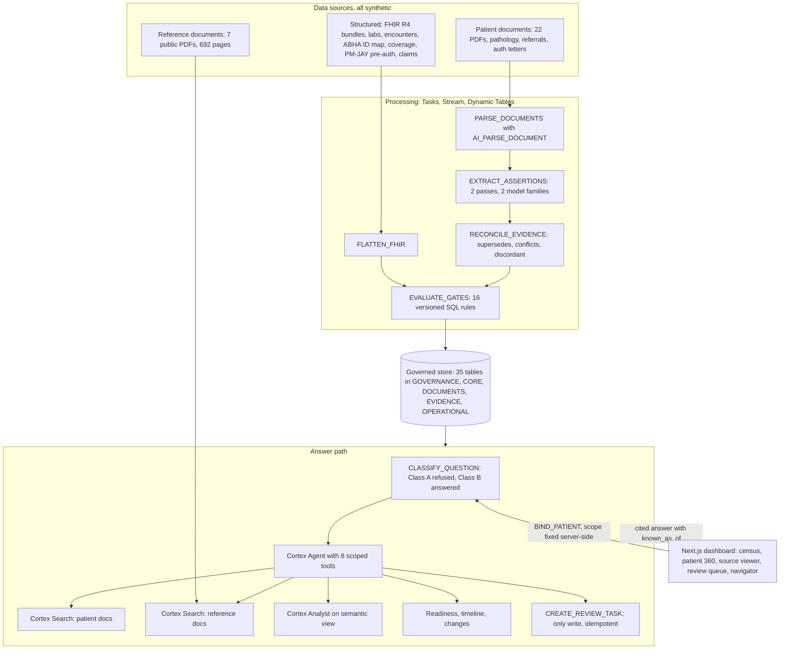

# SAARTHI: architecture and impact

Submission answers for **Section 2 (Architecture Diagram)** and **Section 3 (Impact Statement)**. Compiled from
`README.md`, `docs/project/PROJECT-OVERVIEW.md`, `docs/architecture/ARCHITECTURE-HANDOFF.md`,
`backend/skills/README.md`, `evidence/coco/README.md` and
`docs/research/patient-reality/`. Synthetic data only; engineering checks are not clinical validation.

> **SQL decides. AI extracts and phrases. The practitioner stays accountable.**

## 2. Architecture

Source records and documents land in a governed Snowflake store, pass through parsing, two-model extraction and
versioned SQL rules, and come back to the coordinator as a cited answer stamped with `known_as_of`.

### System and data flow



Security across every layer: row access policy keyed on `CURRENT_USER()`, `USE SECONDARY ROLES NONE`, consent
re-checked on every tool call, and no tool accepts a `patient_id`.

### CoCo CLI skills and how they connect

Four skills in `backend/skills/`, coordinated by `TASK_SAARTHI_ORCHESTRATOR`. A skill describes how to use the tools;
patient scope lives in owner's-rights procedures the agent cannot reach.

| Skill | Wraps | Runs on |
|---|---|---|
| `clinical-question-routing` | Class A/B cascade in `classify_question.sql` | Every question |
| `evidence-retrieval` | Chooses the patient or reference corpus and assembles page-anchored citations | Every question |
| `risk-stratification` | Reports outcomes from the 16 versioned SQL rules; no prediction | Readiness questions |
| `evidence-reconciliation` | Matches findings across sources; never auto-resolves a disagreement | Conflict questions |

- **Reuse proof:** `reuse-tests/` runs evidence-reconciliation against a second schema with different column names,
  producing one successful mapping and one ambiguity it refuses to resolve.
- **CoCo across the lifecycle:** `evidence/coco/` holds planning (52 sessions), development, execution and testing
  manifests, with checkable session IDs and query IDs.

### Data sources

- **Structured:** FHIR R4 bundles, HL7-style labs, encounters, treatment plans, ABHA identity links, coverage,
  PM-JAY pre-authorisation, claims.
- **Unstructured, patient:** 22 synthetic cohort PDFs, including pathology reports, referrals and authorisation letters.
- **Unstructured, reference:** PM-JAY manual, FDA trastuzumab label, ICMR, NCG and AIIMS guidelines.
- The two corpora are kept in physically separate Cortex Search services (rule R6).

### How modules plug together

- **Rules are data.** `RULE_CATALOG` stores ID, version, threshold, severity and guideline. A new check is new rows plus
  fixtures.
- **Scope is server-side.** Tools take no patient selector, so the UI, agent and skills can each be swapped.
- **Five frozen contracts:** schema, tool signatures, answer JSON, rule definition, error shape.
- **Three clocks:** event, source-recorded and ingested times give an answer as known at any past moment.

## 3. Impact

The patient journey fails when the record fails. The published figures below describe the gap SAARTHI targets; the
engineering results show what the prototype already does on synthetic data.

### The problem today

| Figure | Source |
|---|---|
| 14% of scheduled chemo visits missed, median delay 13.75 days (n=870, Indian tertiary centre) | Cancer Reports 2020, PMC7941559 |
| 74% of breast cancer patients consult two or more facilities; 82.6% hit a delay | TMC breast cancer cohort studies |
| 85% of Tata Memorial patients come from outside Mumbai; trips of 500 to 1,400 km | TMC, IIPS-TMC study |
| 2–5 minutes available to an oncologist for pre-consult chart review | `docs/research/patient-reality/` |

### What the prototype shows (synthetic data only)

| Measure | Result |
|---|---|
| Readiness checks automated | 16 versioned SQL rules, each with a cited source row or page |
| Rule fixtures | 80 written; 28 passed live on the earlier account |
| Two-model document extraction | 68 findings verified; 1 invalid page rejected instead of trusted |
| Offline test suite | 405 Python and 257 web unit tests passing |
| Clinical-judgment questions | Refused for every role and routed to the named treating practitioner |

### How to state time saved

```
monthly hours saved  = eligible visits × minutes saved per readiness check ÷ 60
avoided wasted trips = visits per month × share blocked by a gap that could have been caught earlier
```

Fill these in from a timed test: two or three people review the same synthetic patient by hand and then with SAARTHI.
Report the measured minutes and the sample size.

### Scalability

- Snowflake-native: Dynamic Tables, Tasks, Cortex Search and row access policies scale per hospital.
- Separate search services per tenant are part of the design.
- Indian standards (ABHA, FHIR R4, PM-JAY, NHCX) make onboarding a hospital mapping work, not a rewrite.
- New specialties such as dialysis, transplant or cardiac surgery become new rule rows.

### Beyond the demo

- Insurer pre-authorisation pre-check to catch denials before admission.
- NABH audit packets from the versioned answer history.
- A family bring-list in five languages for the 14 to 21 days between cycles.
- The reconciliation skill reused by other teams on their own schemas.

### Not yet live, per `IMPLEMENTATION-STATUS.md`

- The seven Tasks are created but no scheduled run has been shown.
- The answer validator exists but is not in the answer path.
- 80 eval questions written, none scored; no baseline comparison yet.
- 12 of 100 planned patients; localhost, single operator.

## Deployment update, 6 Oct 2026: account XG46956

`backend/sql/setup.sql` was run end to end on a new trial account (`PVYRHHT-XG46956`, locator `WH11571`, AWS
`ap-northeast-1`) from a Cortex Code session as user `DAKSHA`. This is the first run of the full manifest on a clean
account. Step results are reported by that CoCo session; counts, search services and task states were then checked with
read-only queries.

| Area | Result on XG46956 |
|---|---|
| Account setup | Warehouse `SAARTHI_AI_WH`, role `SAARTHI_APP` granted to `DAKSHA`, `SNOWFLAKE.CORTEX_USER` granted, cross-region inference set to `ANY_REGION` |
| Cortex AI | `AI_COMPLETE` returned `OK` under `SAARTHI_APP` for both R7 models, `llama3.3-70b` and `claude-haiku-4-5`. This trial is not blocked from AI functions |
| `setup.sql` steps 1–19b | Reported passed: database and 7 schemas, tables, row access and masking policies, rules, synthetic data, stream, procedures, dynamic tables, 7 tasks, 2 Cortex Search services, semantic view, skills upload, Cortex Agent, MCP server, judge probes and grants |
| Skills | `upload_skills.sql` ran in step 19 before the agent was created, so the four skills are now uploaded on this account. Not yet exercised in an agent run |
| Fixes needed during the run | Two task files ran `EXECUTE AS USER SITAR`, a user that does not exist here; the agent spec's `additionalProperties: false` was rejected by `CREATE AGENT`. Both fixed in PR #18 |
| Rerun needed | Step 15 was reported passed but `DT_SCHEME_ELIGIBILITY` and `DT_TREATMENT_PLAN` were missing afterwards and were created by hand |
| Counts, checked | 16 rules (17 rows: `ENDO-DEXA-001` has a version 2), 13 patients, `SAARTHI_AGENT` created |
| Cortex Search, checked | Both services active; `PATIENT_DOC_SEARCH` indexes 19 chunks, `REFERENCE_DOC_SEARCH` indexes 628 |
| Tasks, checked | All 7 tasks suspended, so no trial credit is spent on schedules |

**Not done yet on XG46956**

- **Cohort documents not loaded.** The 22 cohort PDFs are not yet uploaded and parsed, and the structured-event CSV
  load processed 0 files, so two-pass extraction has not run on this account. Run
  `deploy/06_cohort_and_documents.sql` and `deploy/08_pipeline_kickoff.sql`.
- **Task user fix not yet deployed.** PR #18 hardcoded `EXECUTE AS USER DAKSHA`; PR #20 replaces that with a deploy-time
  lookup (the user on practitioner `PRAC-01`, else the deploying user). Offline checks pass; re-run the two task files
  on Snowflake after it merges.
- **Web app not yet switched on.** `frontend/.env.local` points at XG46956 with user `DAKSHA`, role `SAARTHI_APP` and
  warehouse `SAARTHI_AI_WH`; live access stays off until the checks above pass.
