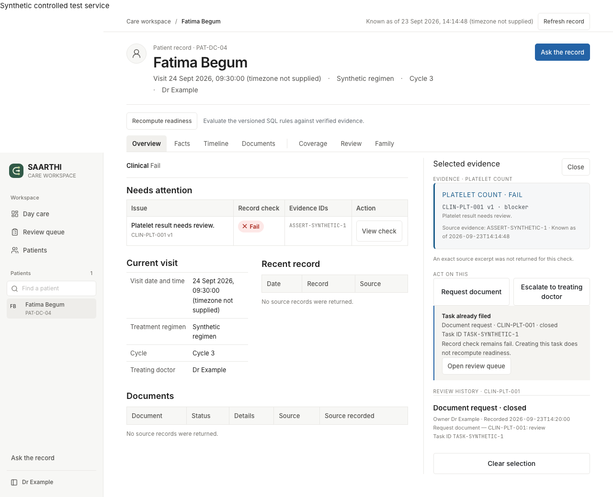

# Operator history and browser recovery — 5 October 2026

Verified against synthetic PAT-DC-04 on NY64016 through the authenticated SQL worksheet.
Application transitions ran as SAARTHI_APP with secondary roles disabled. Accountadmin
read-back checked physical receipt rows; this is application-level history protection,
not protection against a Snowflake administrator rewriting the database.

| Operation | Actual query ID | Observed result |
|---|---|---|
| Capture existing receipt hashes | 01c7837f-0004-0d3e-0001-fe5a0016f496 | Two prior receipts; hash 1081873359999102478 |
| Initial task-ID selector probe | 01c78380-0004-0d3e-0001-fe5a0016f4d2 | invalid_argument; no acknowledgement written |
| Correct rule selector, acknowledge/retry/stale probe | 01c78382-0004-0e08-0001-fe5a0016ceb6 | PASS; version 2 → 3; retry idempotent; stale_task |
| Resolve and compare stored receipt hashes | 01c78384-0004-0d3e-0001-fe5a0016f5ca | PASS; two old receipts preserved; acknowledgement unchanged; two new receipts |
| App role attempts direct no-op UPDATE | 01c78385-0004-0d3e-0001-fe5a0016f5e6 | Denied: table does not exist or not authorized; zero rows |

Target task: `8680b106-71d7-45f1-a5b9-bfc49da0cba8`.
Acknowledgement receipt: `cdc3a9f2-972e-4ed5-b6a3-09940366e039`.
Resolve receipt: `f505abbd-1fb6-4f7d-aa69-dc8bcfa71494`.
Acknowledgement hash before/after resolve: `4798272383091282089`.
Task projection ended resolved. Its associated clinical rule was not approved by this action.

Failure cause: deployed GET_WEB_PATIENT_DATA accepts a rule selector for tasks and returned
no rows for the task-ID selector. The current source additionally supports task-ID read-back,
but that source change is not deployed. The verification harness uses the existing rule
selector and checks the returned task identity. It rejects missing/ambiguous projections.

## Browser recovery

Eight Chromium recovery tests passed in 5.1 seconds on 5 October. The isolated production
build excludes credentials and uses controlled synthetic routes. The new test stores a
task in its controlled service, drops the first POST response, reloads, retries with the
same request ID, and receives the same saved task. This is UI behavior proof; its simulated
service is not the live SQL database. The 40-test fixture suite from 4 October overlaps
seven of these tests; do not add 40 + 8 as a distinct-test count.



Initial sandbox execution could not bind localhost:3100 (EPERM). The permitted local-server
rerun passed all eight tests. No application failure was hidden by suppressing assertions.

## Reproducible database runner

```bash
.venv/bin/python -m backend.scripts.verify_history_receipts \
  --patient PAT-DC-04 --task NEW_OPEN_SYNTHETIC_TASK_ID --rule CLIN-PLT-001
```

Use a new open synthetic task without transition receipts. The runner acknowledges and
resolves it, retains actual query IDs, checks sequential replay and stale-version denial,
compares prior receipts, and proves direct application UPDATE is denied. It does not reuse
the already-resolved task above. The golden-loop runner now includes this check after saving
its new action; new-document extraction and one connected live-browser golden loop remain
dependent acceptance work. No live success is inferred from the offline runner tests.
