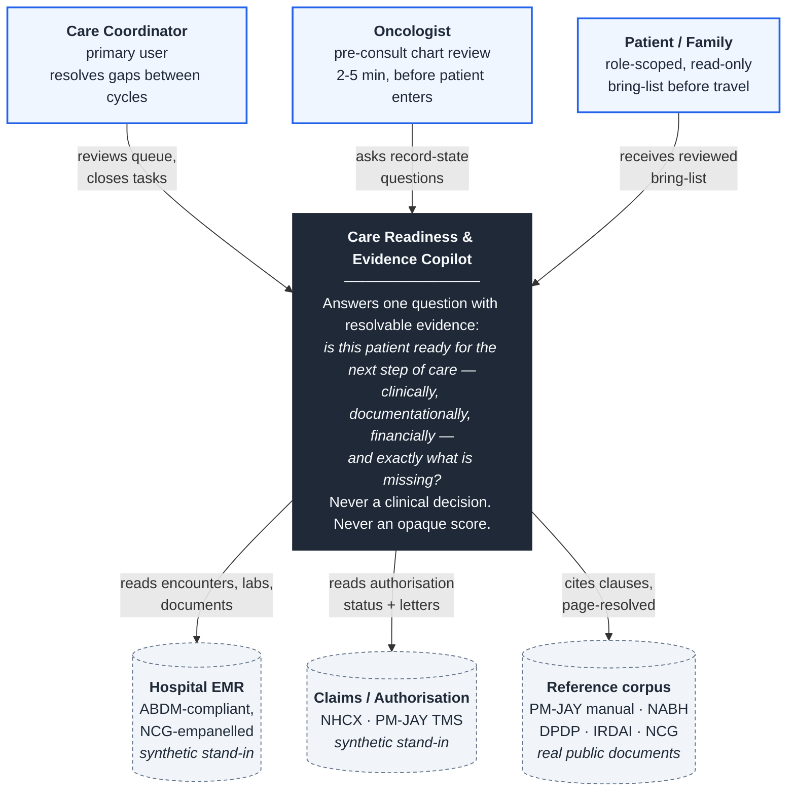
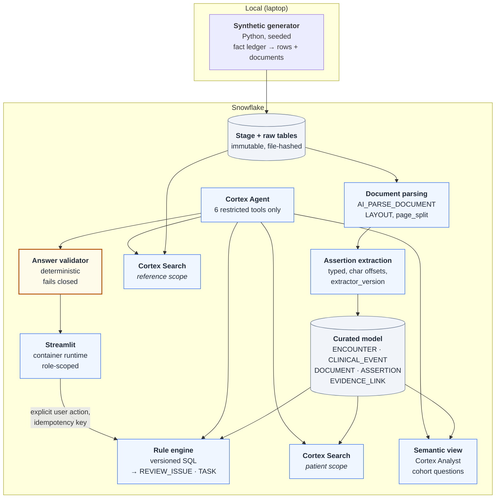
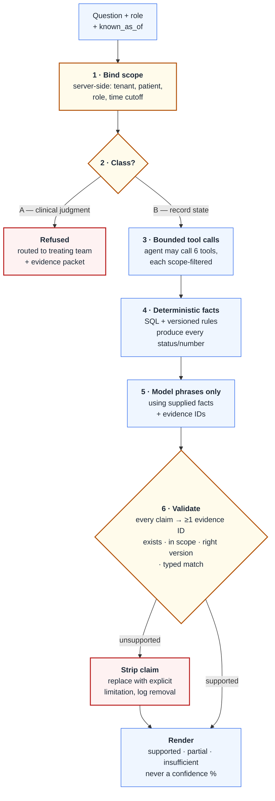
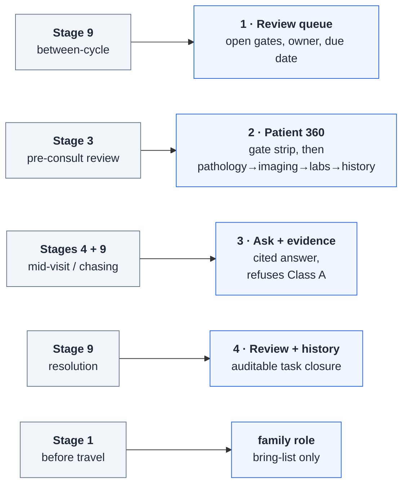

# Architecture — C4 model

Diagrams as code (Mermaid), versioned next to the system they describe. Renders natively in GitHub.
If a diagram and the code disagree, the diagram is a bug — fix it in the same PR.

Method: [C4 model](https://c4model.com) — Context → Container → Component. Level 4 (Code) is
intentionally omitted; it's the layer most prone to drift and least useful to a reviewer.

---

## Level 1 — System Context

Who uses it, what it talks to, and what it is *not*.

**Positioning:** this is an evidence and readiness *layer on top of* an ABDM-compliant EMR — not a
replacement EMR. Six oncology EMRs are already empanelled by NCG/KCDO under LEAP
(see `study-01-clinical-reading.md` §2.1).

---

## Level 2 — Containers

**Rendered version (authoritative): [`diagrams/architecture-container.drawio.png`](diagrams/architecture-container.drawio.png)**
Editable source: `diagrams/architecture-container.drawio` (open in draw.io). SVG also exported.
Both exports embed the diagram XML, so either file reopens as an editable diagram.

Three things the rendered version makes explicit that the Mermaid below does not:
- **The reference corpus is a real ingestion path**, not a service that materialises from nowhere — real public PDFs land, are parsed, and are indexed separately (R6).
- **`AI_PARSE_DOCUMENT` is shared by both corpora; assertion extraction is patient-scope only.** Reference documents become searchable pages but never patient `ASSERTION`s.
- **R1–R6 are anchored to the band where each is enforced**, so the diagram shows where a rule lives in code rather than asserting it in prose.

The Mermaid below is kept as the diff-able structural source of truth — if the two disagree, that is a bug.

Everything inside the boundary runs in Snowflake. Arrows are data flow.

**Two corpora never share a ranked list** (`plan.md` R6) — `searchP` and `searchR` are separate
services. "What does the patient's record say" and "what does the policy require" are different
questions with different evidence standards.

---

## Level 3 — The answer path, with enforcement points

The most important diagram in the repo. Amber = a guard that can refuse or strip.
This is where "never opaque predictions" stops being a claim and becomes control flow.

**Read it as four invariants:**

| Step | Invariant | Plan ref |
|---|---|---|
| 1 | Scope is bound in a trusted backend, not by the model remembering a `WHERE` clause | R5 |
| 2 | Clinical-judgment questions are refused for **every** role, including clinicians | §1.2 |
| 4 | The model never produces a status, number, date or gate outcome — SQL does | R1 |
| 6 | An unsupported claim is removed, not softened. The validator fails closed | §6 |

The single failure mode this design exists to prevent: an answer that *looks* cited without *being*
cited (`plan.md` §6.5).

---

## Level 2.5 — Screen map

Which screen serves which stage of the department workflow (`oncology-department-map.md`).

---

## Maintenance rule

Pin scope in `AGENTS.md`; validate Mermaid syntax in CI before it reaches the repo; keep each diagram
to 6–15 nodes and split rather than sprawl. A diagram that outgrows one screen has become two diagrams.
